# LP System
## User Manual & System Documentation

**Documentation version:** 1.0
**Date generated:** September 3, 2026
**Based on:** the current deployed implementation, branch `claude/printing-business-mvp-v8995g`, commit `01cc2e3`
**Business:** LP Printing — Business Management System

> This manual was produced by directly auditing the running application's source code, database schema, and live UI — not by assuming what a printing-business system "should" have. Every workflow described here reflects what the system actually does today. Where a feature exists in the interface but is not fully functional, this is stated explicitly in an **Important Note**, rather than presented as working.

---

# Table of Contents

1. Introduction
2. System Overview
3. Getting Started
4. User & Staff Management
5. Customer Management
6. Quotations
7. Orders
8. Job Orders
9. Production & Workflow Templates
10. Inventory & Suppliers
11. Services & Promotions
12. Payments
13. Statement of Account (SOA)
14. Receivables
15. Invoices
16. Document Numbering & QR Codes
17. Customer Portal
18. Public Order Tracking
19. Notifications & Email
20. Reports & Financial Management
21. Business Settings
22. Mobile & Tablet Usage
23. Troubleshooting
24. FAQ
25. Glossary

---

# 1. Introduction

LP System is a web-based business management platform built for a printing business. It runs the full life of a job — from a customer's first inquiry, through quoting, ordering, production, quality control, and delivery, to payment collection and financial reporting — in one system, accessible from a desktop browser, tablet, or phone.

This manual is written for a new employee who has never used LP System before. It follows the natural order of the work: how to log in, how accounts and permissions work, how a customer becomes a quotation, how a quotation becomes an order, how an order becomes a job that moves through production, how payments are recorded and tracked, and how customers — with or without an account — can check on their own orders.

Every screenshot in this manual was captured from the running system. Names, emails, and amounts shown are demonstration data, not real customer or business information.

# 2. System Overview

LP System has five kinds of accounts, and what a person can do depends entirely on which kind of account they have and — for Staff — which specific permissions have been granted to them.

| Role | Who they are | Where they land after login |
|---|---|---|
| **Administrator (Admin)** | Runs the business. Full access to everything, always. | Admin Dashboard |
| **Staff** | Office/sales/production staff. Access is controlled permission-by-permission — two Staff accounts can see completely different menus. A Staff member whose job title is "Graphic Artist" also gets a Design Queue (see Chapter 9). | Dashboard (scoped to their permissions) |
| **Production** | Shop-floor staff who run the production boards. | Production Dashboard |
| **Customer** | A client with a login. Sees only their own quotations, orders, invoices, and statements. | Customer Dashboard |
| **Guest (no account)** | Anyone with an order/quotation reference number. | Public Track Order page (`/track`) |

The same web pages are reused across roles wherever the underlying data is the same — for example, a Customer viewing their own order uses the exact same order detail page a Staff member uses, just with everything they're not allowed to see or do hidden. This means the screens in this manual look consistent no matter who is using them.

**Important Note:** There is no separate "customer portal" codebase — Customers sign in to the same application, at the same web address, as Staff and Admin. The system simply shows and hides sections based on the signed-in account's role and permissions.

# 3. Getting Started

## 3.1 Logging In

**Purpose:** Sign in to LP System with your account.

**Who Can Use It:** Everyone with an account (Admin, Staff, Production, Customer).

**Step-by-Step**

1. Open the LP System web address in your browser.
2. You will land on the **Login** page (Figure 1).
3. Enter your **Email** and **Password**.
4. Click **Sign In**.

**What Happens Next**
The system checks your credentials and your account's `active` status. If both are valid, you're taken to the dashboard for your role. Your session stays signed in until you log out or your password/account is changed by an Admin (see 3.5 and Chapter 4).

**Important Notes**

- A wrong email or password always shows the same generic message, **"Invalid email or password"** — the system deliberately does not reveal whether the email exists, as a security measure.
- If your account has been deactivated by an Admin, you will also see "Invalid email or password" when trying to log in — deactivated accounts cannot sign in at all (see 4.4).
- Google and Facebook sign-in are available on the login screen for accounts that have connected them (mainly Customers).

*Figure 1 — The LP System Login page.*
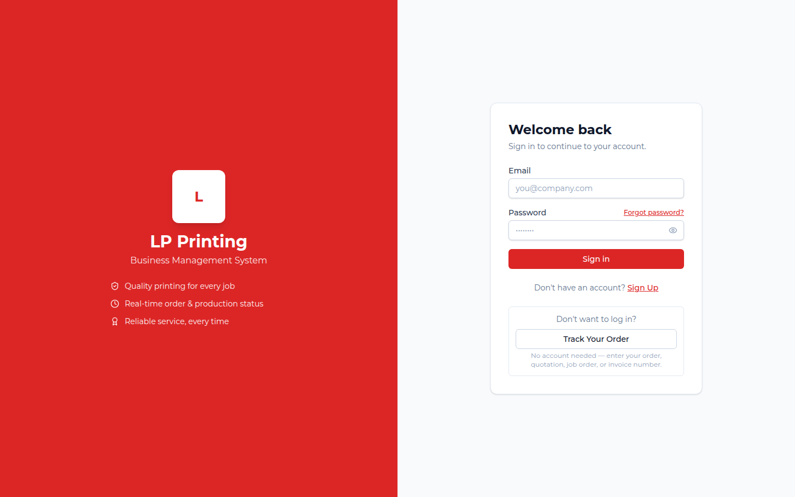

## 3.2 Logging Out

**Purpose:** End your session securely.

**Who Can Use It:** Everyone.

**Step-by-Step**

1. Click **Sign out** in the top-right corner of the header (desktop) or in the mobile menu.

**What Happens Next**
Your session is immediately and permanently invalidated on the server — not just your browser's cookie. Even a page that was already open in another tab, or a request already "in flight" when you clicked Sign out, will be rejected the next time it reaches the server. You're returned to the Login page.

## 3.3 Navigation

The main interface has three consistent parts on desktop:

- **Left sidebar** — grouped links to every module you have access to (Main, Operations, Finance, Customers, Management, System — the exact groups you see depend on your role/permissions).
- **Top header** — global search, the Chatbox icon, the notification bell, your name/role, and Sign out.
- **Main content area** — the page itself.

## 3.4 Notifications

**Purpose:** Get alerted to things that need your attention without leaving the page you're on.

**Who Can Use It:** Everyone with an account.

**Step-by-Step**

1. Click the bell icon in the header.
2. A dropdown lists your most recent notifications (up to 15), newest first.
3. Click a notification to go to what it's about. Chat-related notifications open the floating Chatbox instead of navigating away.
4. Click **Mark all read** to clear the unread count.

**Important Notes**

- What you're notified about depends on your role: Staff/Admin are notified about business events (new inquiry, quotation approved, payment recorded, etc.); a Customer is only ever notified about their own account's events.
- The bell is the same component for every role — only its contents differ.

*Figure 2 — The notification bell open over the Admin Dashboard.*
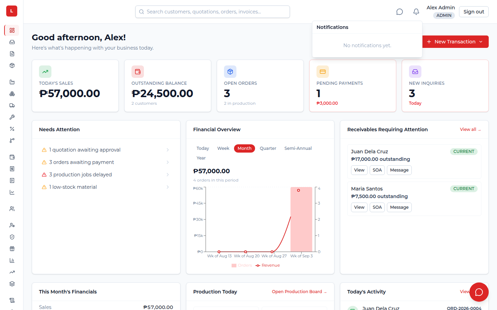

## 3.5 Password & Account Basics

- You cannot see or recover your current password — only set a new one.
- A Customer can change their own password from **My Profile** (Chapter 17).
- A Staff member's password can only be changed by an Admin, from their Staff & Permissions record (Chapter 4) — there is currently no "change my own password" self-service page for Staff/Admin accounts in this system.
- Changing a password immediately invalidates every existing session for that account — if you're signed in elsewhere, you'll be signed out the next time you load a page.

## 3.6 Responsive / Mobile Usage

LP System adapts to desktop, tablet, and phone screens automatically. See Chapter 22 for role-specific mobile guidance and screenshots.

---

# 4. User & Staff Management

This chapter covers everything under the **Users** and **Staff & Permissions** menu items, visible to Admins (and, for parts of it, to Staff with the right permissions).

## 4.1 Two Different Account Lists

LP System has two related but distinct admin screens:

- **Users** (`/admin/users`) — lists *every* account in the system regardless of role (Admin, Staff, Production, Customer). Its only real action is a quick **Activate/Deactivate** toggle next to each account.
- **Staff & Permissions** (`/admin/staff-permissions`) — lists only accounts with the **Staff** role, and is where you configure exactly what each one is allowed to do.

*Figure 3 — The Users list.*
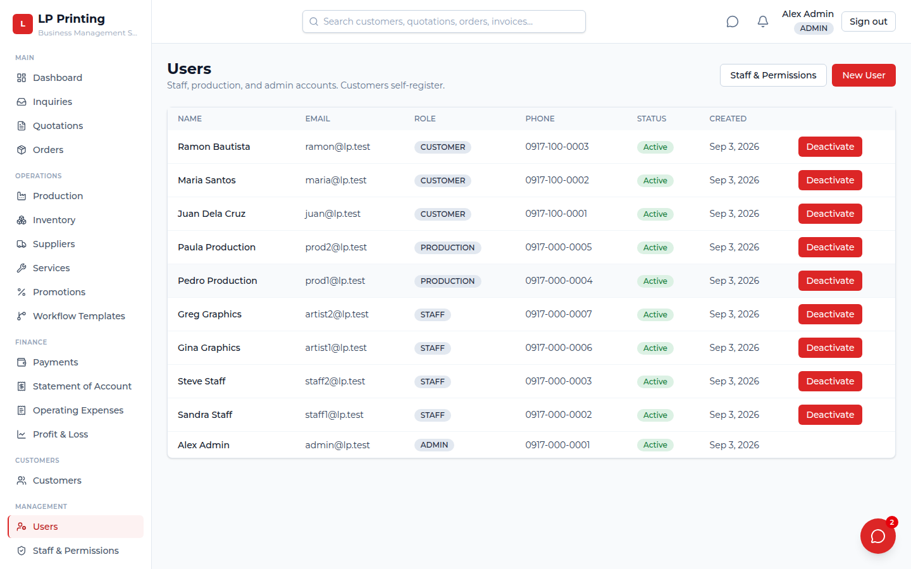

*Figure 4 — The Staff & Permissions list.*
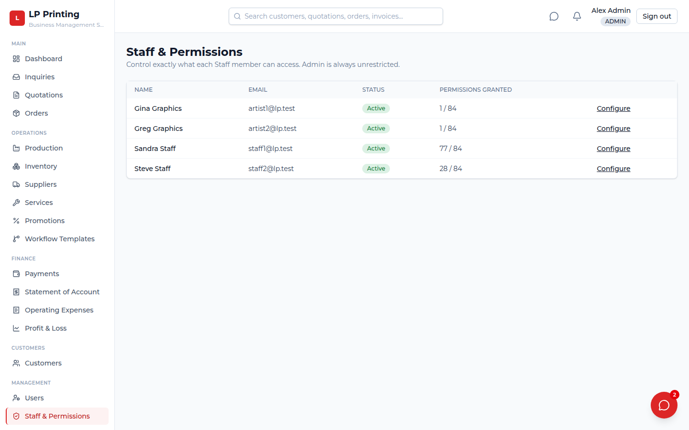

## 4.2 Creating a Staff Account

**Purpose:** Give a new employee a login.

**Who Can Use It:** Admin only.

**Step-by-Step**

1. Open **Users** from the sidebar.
2. Click **+ New User** (or the equivalent button on the Users page).
3. Enter Name, Email, Password, and choose a Role (Staff, Production, or Admin).
4. Optionally enter a Phone number.
5. Click **Save**.

**What Happens Next**
The account is created immediately and can log in right away with the password you set. A new **Staff** account starts with **no permissions granted** — you must open its Staff & Permissions page and grant a preset or individual permissions before it's useful (4.3).

**Important Notes**

- There is no email-verification step for admin-created accounts — they're active immediately.
- Passwords are never stored, logged, or shown in plain text anywhere in the system — only a securely hashed form is kept.

## 4.3 Assigning Permissions

**Purpose:** Control exactly which parts of the system a Staff member can see and act on.

**Who Can Use It:** Admin.

**Step-by-Step**

1. Open **Staff & Permissions** and click into a Staff member's record.
2. Under **Permissions**, either choose a **Preset** from the "Apply a preset" dropdown (e.g. Manager, Sales Staff, Cashier, Customer Service) to grant a ready-made bundle, or tick individual permission checkboxes yourself, grouped by area (Inquiry, Quotation, Orders, Payments, Production, Design, Inventory, Reports, etc.).

3. Click **Save Permissions**.

**What Happens Next**
The change takes effect immediately — the affected Staff member's sidebar and available actions update on their very next page load or refresh. No re-login is required.

**Important Notes**

- Permissions are fully independent per Staff member. Two Staff accounts can have completely different access — one may only see Inquiries and Quotations, another may see Payments and Reports, and so on.
- A Staff member's job **title** (e.g. "Graphic Artist") is just a label. What actually grants them the Design Queue is holding the **DESIGN_VIEW** permission — title and permission are set separately, but in practice a Graphic Artist should always have both.
- Editing a Staff account's Name/Email/Contact/Password (4.4 below) **never** changes their role or their permissions — those stay exactly as configured until an Admin deliberately changes them here.

*Figure 5 — Staff & Permissions detail page, with the permission checklist.*
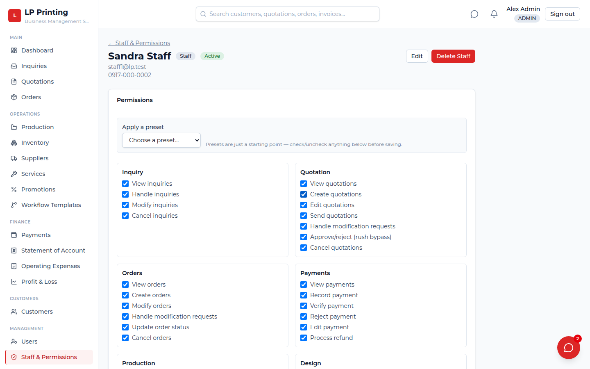

## 4.4 Editing a Staff Account

**Purpose:** Update a Staff member's name, email, contact number, or password without creating a new account or touching their permissions.

**Who Can Use It:** Admin only — enforced on the server, not just hidden in the menu.

**Step-by-Step**

1. Open the Staff member's Staff & Permissions detail page.
2. Click **Edit** next to their name.
3. Update Name, Email, and/or Contact Number as needed.
4. To change their password, fill in **New Password** and **Confirm New Password**. **Leave both blank to keep their current password unchanged.**
5. Click **Save Changes**.

**What Happens Next**
The page updates immediately with no manual refresh. If a new password was set, that Staff member's existing sessions are invalidated — they'll need the new password the next time they sign in. Their role and permissions are untouched.

**Important Notes**

- The email must be a valid format and not already used by another account — if it's a duplicate, you'll see an error and nothing is saved.
- Contact number is a free-text field with no required format — use your organization's usual convention (e.g. `0917-000-0000`).
- The current password is never shown, logged, or retrievable — only a new one can be set.

*Figure 6 — The Edit Staff Account dialog.*
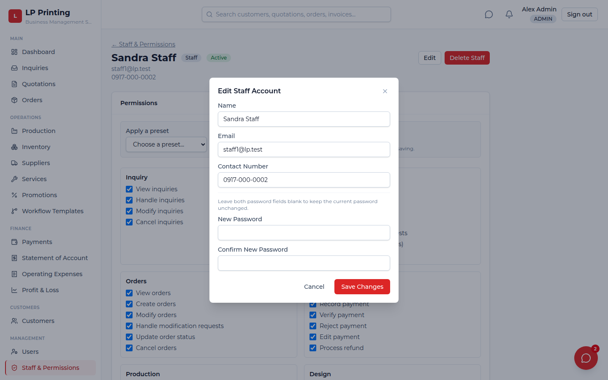

## 4.5 Deactivating ("Deleting") a Staff Account

LP System does not permanently delete Staff accounts. Every quotation, order, payment, or production record a Staff member ever touched keeps their name attached forever — a hard delete would break that history. Instead, "Delete Staff" **deactivates** the account: it can no longer log in or do anything, but its name stays correctly attached to everything it already did.

**Purpose:** Remove a departing or suspended Staff member's access while preserving all historical records.

**Who Can Use It:** Admin only.

**Step-by-Step**

1. On the Staff member's detail page, click **Delete Staff**.
2. A confirmation dialog appears, naming the exact account and explaining what will happen (Figure 7).
3. Click **Delete Staff** again to confirm, or **Cancel** to back out.

**What Happens Next**

- The account is marked inactive. It can no longer sign in, and if it happens to already be signed in somewhere, that session is invalidated on its very next request.
- Every quotation, order, payment, audit log entry, etc. this person ever created or was assigned to still correctly shows their name.
- The Staff & Permissions page updates immediately — no manual refresh.

**Important Notes / Safeguards** — all enforced on the server, not just hidden in the interface:

- **You cannot deactivate the last remaining Admin account.** The system always requires at least one.
- **You cannot deactivate your own account**, under any circumstances.
- **You cannot deactivate a Staff member who has active, unfinished production or design work assigned to them** (an in-progress job order stage, or an unresolved rework item). You'll see a message telling you how many active assignments exist — reassign or complete that work first (see Chapter 9 for reassignment).
- A non-Admin account attempting any of this — editing, changing a password, or deactivating another account — is rejected by the server, regardless of what the browser shows.

*Figure 7 — The Delete Staff confirmation dialog.*
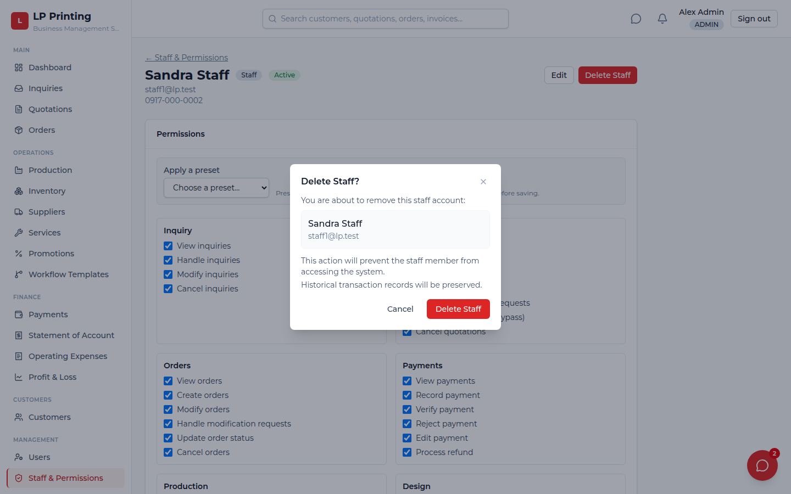

## 4.6 Quick Activate/Deactivate from the Users List

The **Users** page (4.1) offers the same activate/deactivate action as a single-click toggle next to every account, for any role — not only Staff. It shares the exact same safeguards described in 4.5 (last-admin protection, no self-deactivation, active-assignment protection where relevant).

---

# 5. Customer Management

## 5.1 How a Customer Account Comes to Exist

There are two ways a Customer record can exist in LP System:

1. **Self-registration** — a person visits the **Sign Up** page, fills in Name, Email, Phone, Company (optional), and a Password, and gets an account and a login immediately. There is no email-verification step; the new account can sign in right away.
2. **Staff/Admin quick-add** — Staff with `CUSTOMER_CREATE` (or an Admin) add a customer record with just their basic details, with **no login** attached. This is useful for a walk-in customer or one you're quoting for by phone.

A login-less customer created by Staff can later be given a login via **Activate Login** on their profile (5.3) — this attaches a login to the *existing* customer record rather than creating a duplicate.

## 5.2 Creating a Customer (Staff/Admin)

**Purpose:** Record a new customer so quotations, orders, and invoices can be created for them.

**Who Can Use It:** Staff with `CUSTOMER_CREATE`, or Admin.

**Step-by-Step**

1. Open **Customers** from the sidebar.
2. Click **+ New Customer**.
3. Enter the customer's Name (required) and, optionally, Address, Contact Number, Email, and Facebook URL.
4. Click **Save**.
5. Confirm the customer now appears in the Customers list.

**What Happens Next**
The customer record exists immediately and can be selected on a new Quotation or Order. It has no login yet.

*Figure 8 — The Customers list.*
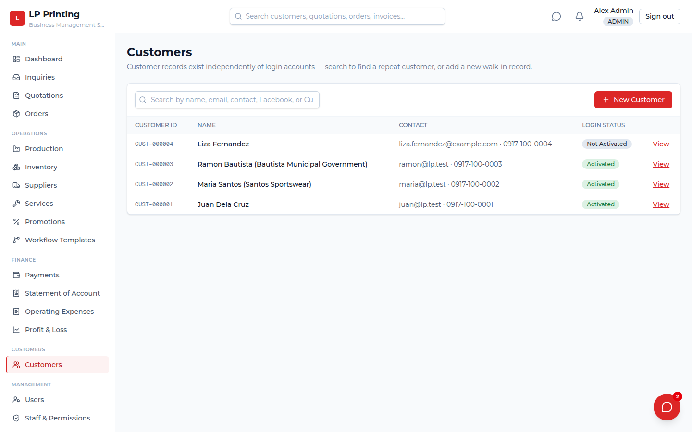

*Figure 9 — Add Customer form.*
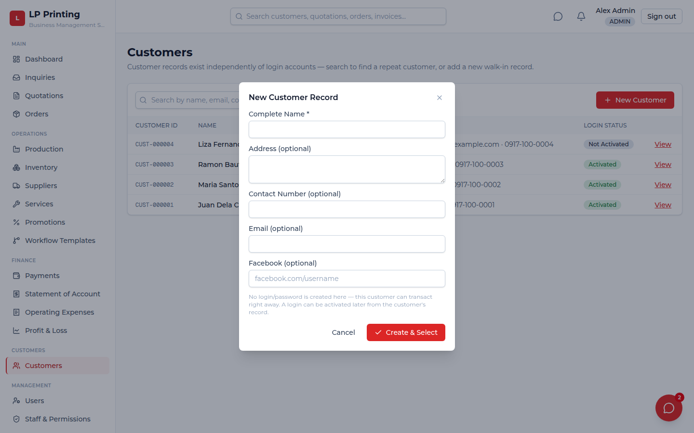

## 5.3 Customer Detail Page

Opening a customer shows: their editable **Customer Information**, a **Login Account** section (whether one is activated, and whether it's currently active), and their **Recent Quotations**, **Recent Orders**, and **Recent Inquiries** (last 5 each, with links to the full record).

**Editing** a customer's information uses the same form as creation and requires `CUSTOMER_EDIT`.

**Activate Login** attaches an email + temporary password to a customer record that doesn't have one yet, so they can sign in going forward.

*Figure 10 — Customer detail page.*
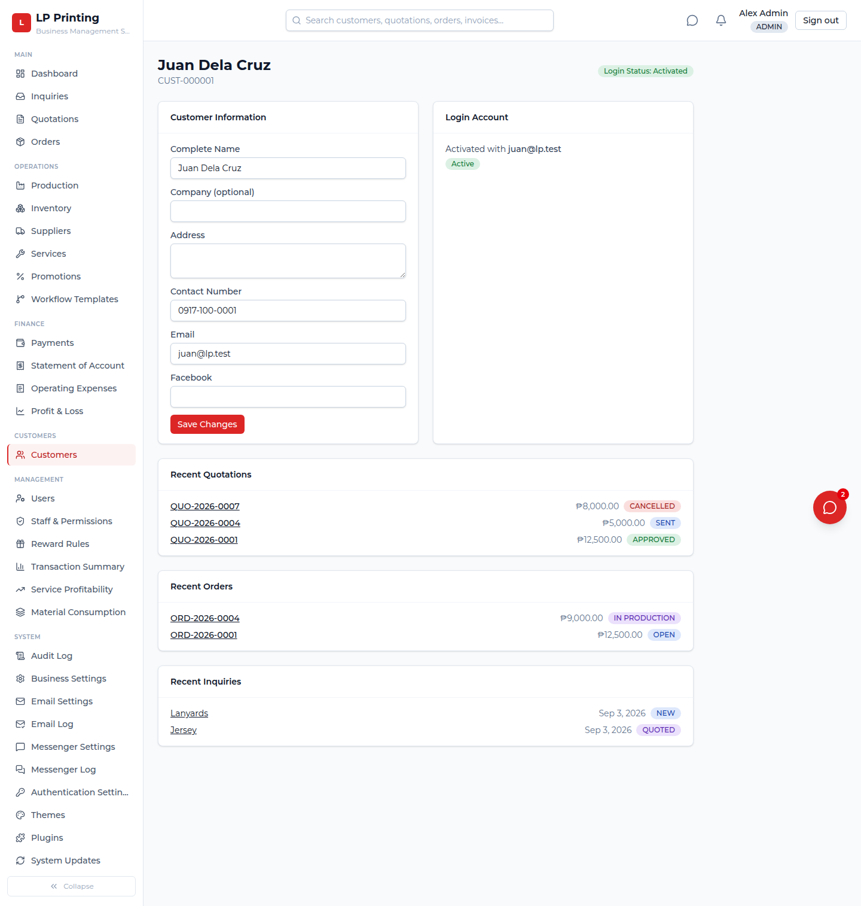

**Important Note:** There is a permission called "Activate/Deactivate customer" in the permission list, but as of this version it is not wired up to any actual control in the interface — do not expect a working customer-deactivation button. If a customer's login needs to be disabled, that is not currently a supported action distinct from deactivating any other account type.

## 5.4 Where Customer Financial Info Lives

The customer detail page itself does **not** show invoices, payments, or a running balance directly — that lives in the **Statement of Account** section instead (Chapter 13) and the **Receivables** dashboard (Chapter 14).

## 5.5 Customer Rewards

LP System has a working points-based rewards program tied to each customer:

- Admins configure **earn rules** (points per currency spent) and **redemption tiers** under **Reward Rules**.
- A customer's points balance is visible on their profile (staff side) and on their own **My Rewards** page (Chapter 17), where they can redeem points for a voucher and see their full earn/redeem history.
- Vouchers earned this way can be applied as a payment method on an order.

---

# 6. Quotations

A Quotation is where pricing a job for a customer begins. It can come from a customer Inquiry or be created directly, and — once approved — it automatically becomes an Order (6.6).

## 6.1 Creating a Quotation

**Purpose:** Propose pricing and scope for a job to a customer.

**Who Can Use It:** Staff with `QUOTATION_CREATE` (sending it also requires `QUOTATION_SEND`), or Admin.

**Step-by-Step**

1. Open **Quotations** and click **+ New Quotation** (or open it from a specific Inquiry, which pre-fills the customer).
2. Choose the **Customer**.
3. Add one or more line items: Service, Description, Quantity, Unit, and Unit Price (plus any spec details the service calls for).
4. Set the overall **Discount %** and **Tax/VAT %** (default 12%) if applicable.
5. Add any Notes and a "Valid until" date.
6. Choose whether to save as **Draft** or send it immediately.
7. Click **Save**.

**What Happens Next**
The system independently recalculates the subtotal, discount, tax, and total from the line items you entered — it never simply trusts whatever total appears on screen. If the quotation was created from an Inquiry, that Inquiry is marked **Quoted**.

**Important Notes**

- You can't have two quotations open at once against the same Inquiry.
- A Quotation's full status list is: **Draft, Sent, Approved, Rejected, Revision Requested, Cancelled.**

*Figure 11 — New Quotation form.*
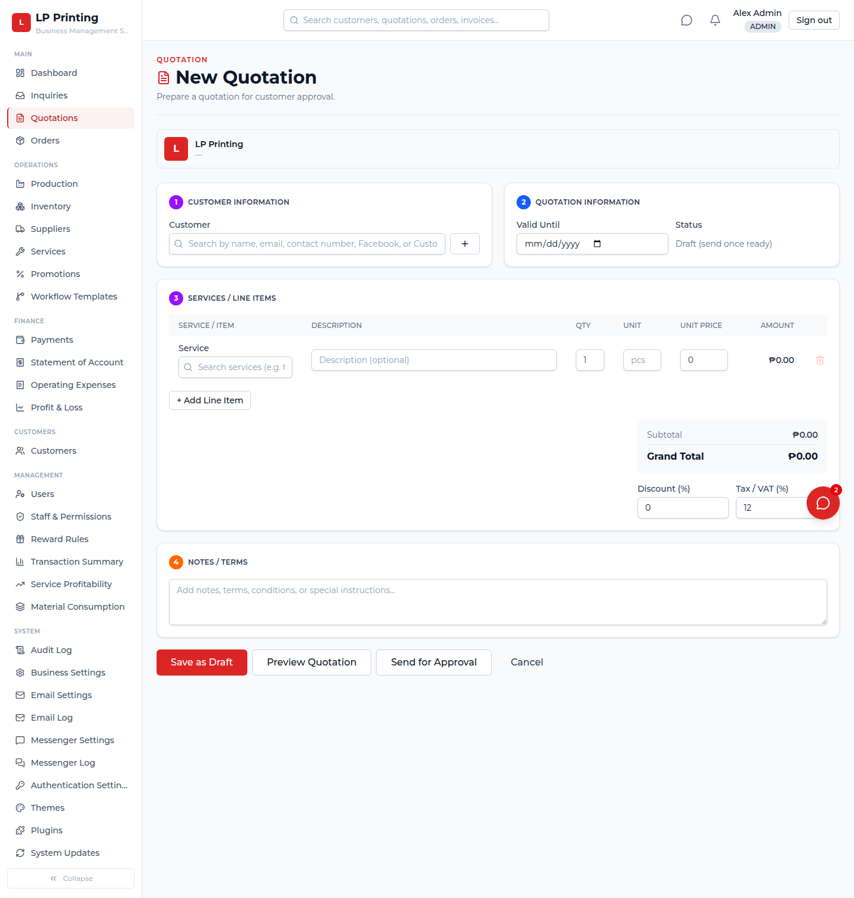

*Figure 12 — Quotations list.*
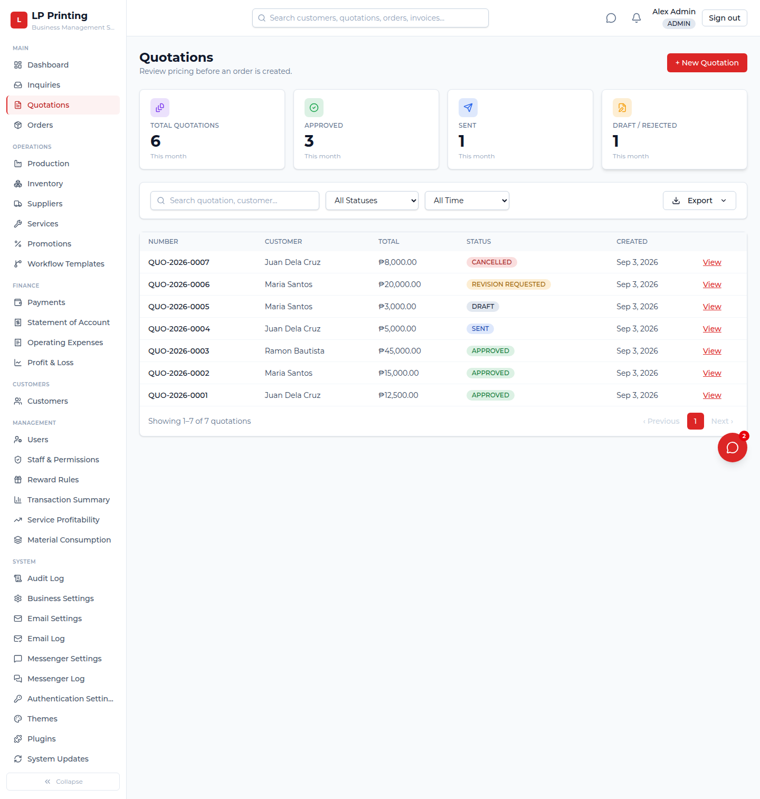

## 6.2 Viewing a Quotation

A quotation can be opened either as a full page or as a **Quotation Details** popup from the list (which additionally offers quick actions: Approve on Behalf, Convert to Order, Print/Download, Share). The formal printable version is the **Quotation Document** (Figure 13), showing the quote number, dates, status, customer details, line items, totals, and an Approval section recording who prepared and who approved it.

*Figure 13 — Printable Quotation document.*
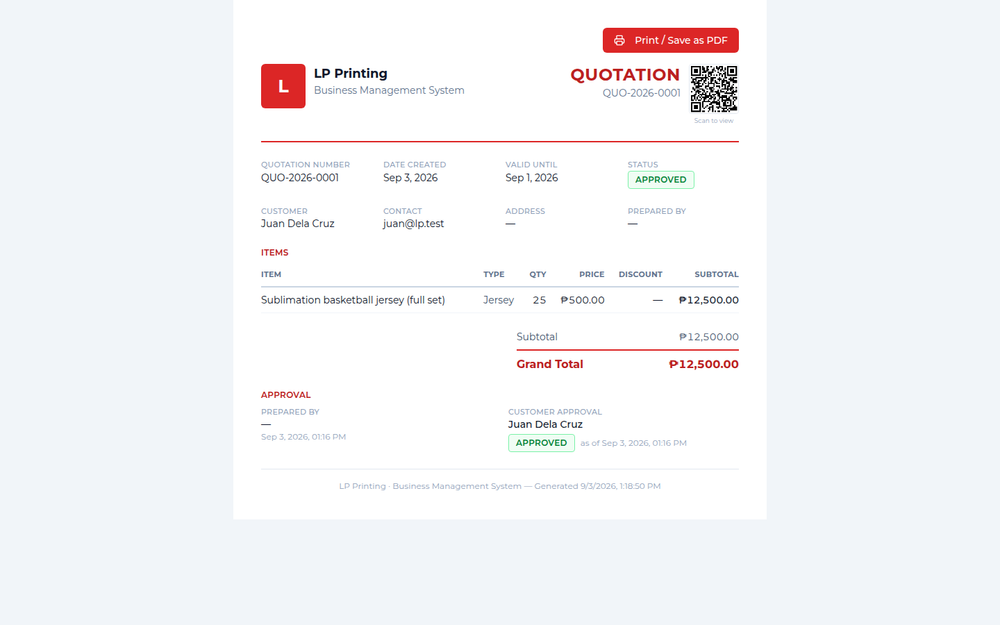

## 6.3 Editing a Quotation

**Purpose:** Correct or update a quotation before it's finalized.

**Who Can Use It:** Staff with `QUOTATION_EDIT`, or Admin — only while status is **Draft, Sent, or Revision Requested**.

**Important Notes**

- The edit form does not expose separate discount%/tax% fields — instead, editing line items automatically re-applies the quotation's existing discount and tax **rate** to the new subtotal, so the effective discount/tax proportionally follows the total, rather than resetting to zero.
- A Customer viewing their own **Sent** quotation gets a narrower self-edit option — quantity and description only, with pricing recalculated automatically where the service supports live pricing.

*Figure 14 — Quotation detail page.*
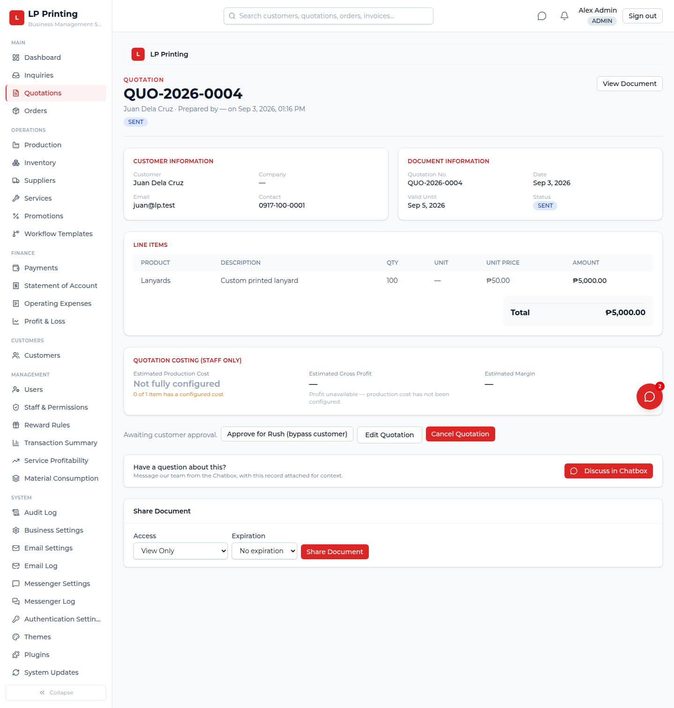

## 6.4 Approval

There are two ways a quotation gets approved:

**A. Customer Approval** — the customer, viewing their own **Sent** quotation, clicks Approve (or Reject, with a required reason, or Request Revision).

**B. Staff Approval on Behalf of the Customer** — for a rush job or a customer who approved verbally/by phone, Staff/Admin with `QUOTATION_APPROVE_REJECT` can approve it directly. This **requires typing a reason** (at least a few words) — the system records that this was a staff override, distinct from a genuine customer approval, along with which staff member did it and when, so the audit trail always shows exactly what happened.

**What Happens Next (either path)**
The quotation becomes **Approved**, and the system **automatically creates the matching Order** right away (see Chapter 7) — you do not need to separately click "Convert to Order" afterward.

## 6.5 Send to Customer

**Purpose:** Deliver a quotation to the customer for review.

**Step-by-Step**

1. From the quotation (Draft or Revision Requested), click **Send to Customer**.

**What Happens Next**

- If the customer has an activated login, they're notified inside the app the next time they sign in.
- Regardless of whether they have a login, you can also generate a **shareable link** — a token-based URL that opens a read-only view of the document to anyone who has it, with no login required. This link does not expire on its own and tracks how many times it's been viewed.
- Sending a quotation does **not** by itself send an email — sharing the link (by copying it, or through whatever channel you choose) is a separate, manual step.

## 6.6 Conversion to an Order

Because approval already auto-creates the Order (6.4), you will rarely if ever need to press a separate "Convert to Order" button — by the time a quotation shows as Approved, its Order already exists. A quotation can only ever be converted into **one** Order.

## 6.7 Cancelling a Quotation

Staff/Admin with `QUOTATION_CANCEL` can cancel a Draft, Sent, or Revision-Requested quotation, with a required reason. A cancelled quotation can be **Restored** back to whatever status it was in before cancellation.

---

# 7. Orders

## 7.1 Creating an Order

Most orders come into existence **automatically** the moment a quotation is approved (6.4/6.6) — you don't create them by hand in the normal flow. Staff/Admin with `ORDER_CREATE` can also create an order directly (without a quotation) when needed, entering the customer, total amount, and payment terms by hand.

**Payment terms** on an order are either:

- **Standard Partial** — a required minimum partial-payment percentage (default 50%) before production can start, or
- **Approved Terms** — a documented exception (who approved it, and why) letting production start without that upfront payment.

*Figure 15 — Orders list.*
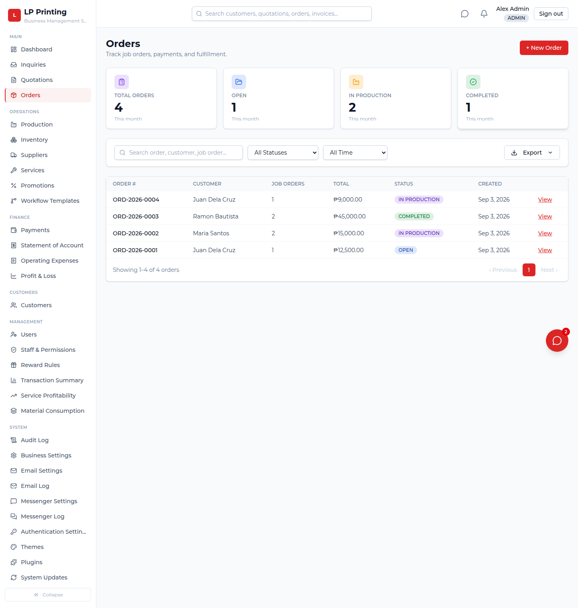

*Figure 16 — New Order form.*
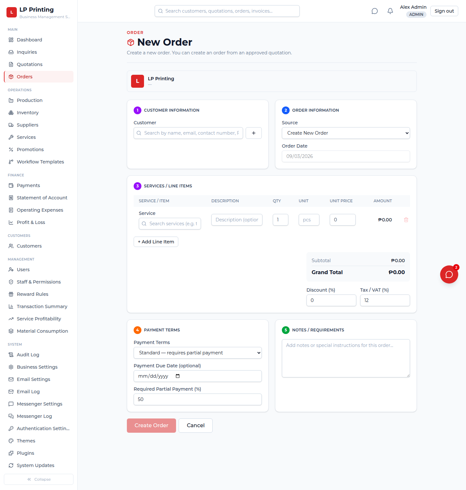

## 7.2 Order Status

An order's status is one of: **Open, In Production, Fulfilling, Completed, Cancelled.**

- **Open** is the default, and is also what an order reverts to whenever a new job order is added to it.
- **Fulfilling** is set automatically the moment the first delivery/pickup record is created for any of its job orders.
- **Completed** happens automatically once every job order under it reaches Released, or can be set manually for an informal case like a walk-in pickup.
- **Cancelled** is only allowed if nothing under the order has been Released or Completed yet, and requires a reason; it can be restored back to its exact prior status.

**Important Note:** The **In Production** status exists in the system but nothing in current production start/stage logic actually sets an order to it — starting production on a job order does not change the parent order's status. Don't be surprised if an order with active production work still shows **Open**.

## 7.3 Order Detail Page & Documents

The order detail page (Figure 17) is the hub for a job: customer/quotation info, its job order(s), payments, deliveries, a cost panel (for Staff with `COST_VIEW`), a customer-facing message thread, tracking-link and document-sharing tools, and the Record Payment action.

From here you can open the printable **Invoice** (Chapter 15) and manage the order's **Job Orders** (Chapter 8).

*Figure 17 — Order detail page.*
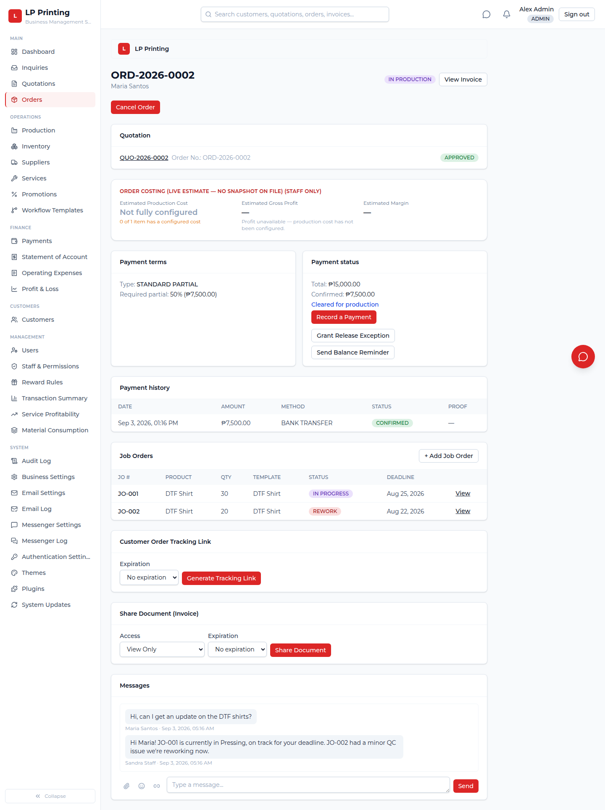

---

# 8. Job Orders

A Job Order is the actual unit of production work under an Order — the thing that moves through the shop floor stage by stage.

## 8.1 Creating a Job Order

The **first** Job Order under an order is usually created automatically once payment requirements are satisfied (or immediately, if the order has Approved Terms). Any **additional** job orders (e.g. a second distinct item on the same order) are added manually:

**Step-by-Step**

1. On the Order detail page, click **+ Add Job Order**.
2. Choose the Service, enter specs/description/quantity, choose the Workflow Template, set a deadline, priority (Low/Medium/High), and any production instructions.
3. Save.

## 8.2 Job Order Detail Page

Shows: customer & job info, description/instructions, materials/consumption and cost summary (where visible), a production progress bar, uploaded Files (with an approval step for design drafts), the full Workflow stage table and history, QC history and any rework, and fulfillment actions (Picked Up / In Transit / Delivered / Installed).

*Figure 18 — Job Order detail page.*
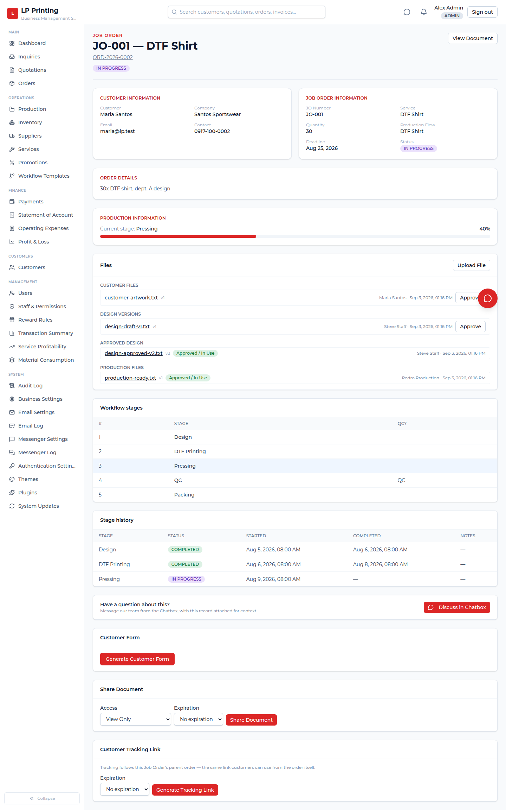

## 8.3 Printing / PDF / QR Code

Click **View Document** on the Job Order page to open its printable document, which includes a QR code. Use your browser's own **Print / Save as PDF** — there is no separate "download PDF" button; the print view *is* the PDF-ready document.

*Figure 19 — Printable Job Order document.*
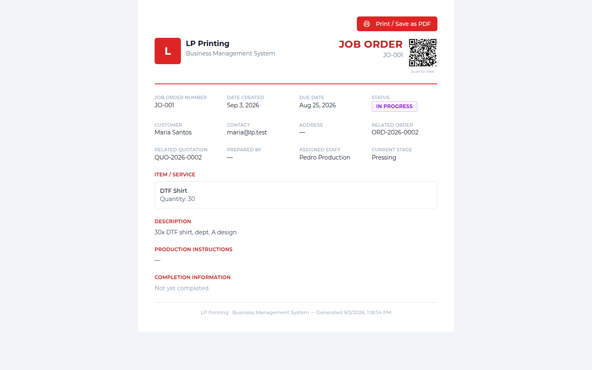

**Important Note on QR codes:** the QR code on every document (Quotation, Invoice, Job Order) links to that document's own page **inside the app** — not to the public tracking page. Scanning it opens the real record, protected by the normal login/ownership check; someone without access still can't see it just by scanning the code.

## 8.4 Status & Customer Visibility

A Job Order's status is one of: **On Hold, In Progress, QC, Rework, Ready, Released, Completed.** A signed-in Customer, and anyone using a tracking link/QR code, sees a simplified, safe version of this same progress — see Chapter 9.4 and Chapter 18.

---

# 9. Production & Workflow Templates

## 9.1 Workflow Templates

A Workflow Template defines the ordered list of stages a type of job goes through. Each stage has a name, an order, and up to two special flags: **QC stage** (exactly one stage per template must be the QC stage) and **Design stage** (at most one — a template can have none, if the work involves no design step).

The actual templates configured in this system, as an example of what a real production flow looks like here:

| Template | Stages |
|---|---|
| Jersey / Uniforms | Design → Printing → Pressing → Sewing → QC → Sorting → Packing |
| Tarpaulin | Design → Printing → Cutting & Finishing → QC → Packing |
| DTF Shirt Printing | Design → DTF Printing → Pressing → QC → Packing |
| Signage | Design → Fabrication → Printing & Mounting → QC → Installation |

**Purpose:** Define the production flow that a Service follows.
**Who Can Use It:** Admin, under **Workflow Templates**.
**Step-by-Step**

1. Open **Workflow Templates → New**.
2. Name it, then add stages in order, flagging exactly one as QC (and at most one as Design, if this type of work involves design).
3. Save.
4. Attach it to a Service from the Service's own edit page (Chapter 11).

*Figure 20 — Workflow Templates list.*
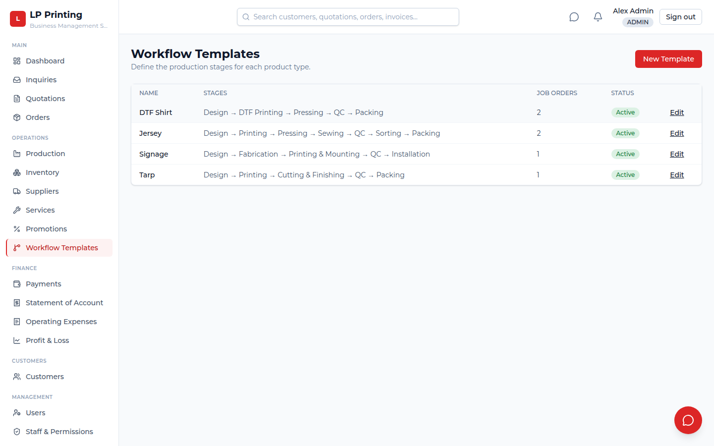

## 9.2 The Production Board

**Purpose:** Move real jobs through their production stages.

**Who Can Use It:** Staff/Production with production permissions, or Admin.

**Step-by-Step**

1. Open **Production** — you'll see an overview with today's KPI counts and one row per Service.
2. Click **Open Board** on a Service to see its focused Kanban board, one column per stage (Figure 21).
3. On a job card, click **Start [stage]** to begin work, then **Start [next stage]** (or **Mark as Ready** on the last stage) once it's done — or drag the card to the next column on desktop.

**What Happens Next**
Completing a stage automatically advances the job to the template's next stage. If that next stage is the QC stage, the job's status becomes **QC** and stays there until a QC result is recorded (9.5) — QC cannot be skipped. Completing the last stage sets the job to **Ready**.

**Important Notes**

- The full drag-and-drop Kanban view is desktop-only (roughly 1024px screens and wider); tablet and mobile show one stage at a time instead (Chapter 22).
- A one-time **Undo** is available for about 10 seconds right after completing a stage.
- **Design-stage** cards show a "Managed by Graphic Artist" badge instead of Start/Complete controls — that stage is worked from the Design Queue (9.3), not the Production board.
- Moving a job out of order (skipping a stage) is rejected by the server — the board always double-checks against the template, not just what the button says.

*Figure 21 — A focused Production board for one Service (Kanban view).*
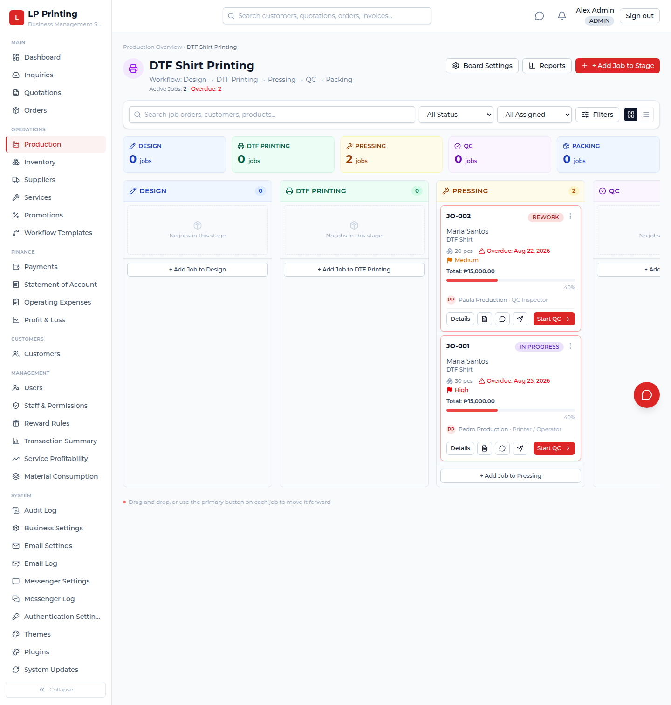

*Figure 22 — Production Overview.*
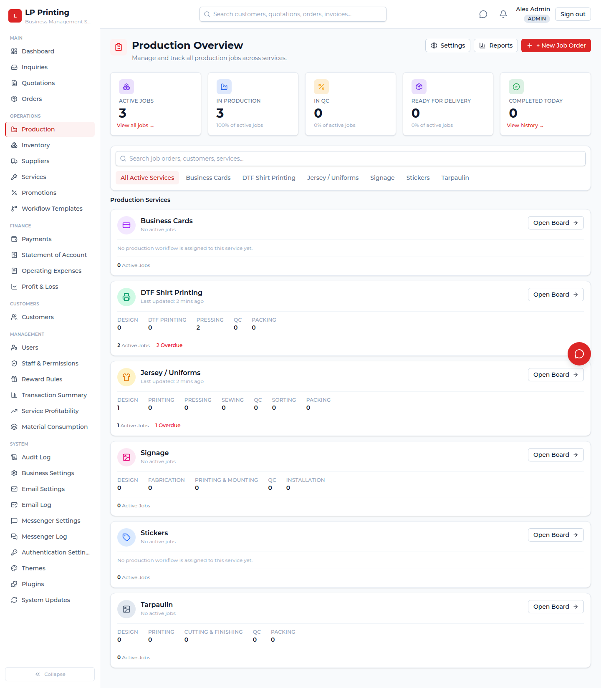

## 9.3 Graphic Artist / Design Queue

**Purpose:** Give Graphic Artists a dedicated queue of design work, separate from the general production board.

**Who Can Use It:** Any active Staff member holding `DESIGN_VIEW` (typically Staff with the "Graphic Artist" title).

**Step-by-Step**

1. Open **Design Queue**.
2. Switch between **My Design Queue**, **In Progress**, and **Completed** using the view selector.
3. Click **Start Design** on an unclaimed job to claim and start it in one step, or **Accept** to claim it without starting yet.
4. When finished, click **Complete**.

**What Happens Next**
Completing a design job runs it through the same stage-completion logic as the Production board, advancing it to the next stage in its workflow.

**Auto-Assignment**
If enabled in Business Settings (**Production → Auto-select Graphic Artist**), a new design job is automatically handed to whichever eligible Graphic Artist currently has the fewest unfinished design jobs — so work naturally spreads out rather than piling on one person. This is **off by default**.

**Reassignment**
Staff/Admin with `DESIGN_MANAGE` can manually assign or reassign a design job to a different Graphic Artist from the job's detail panel — the system only accepts an active Staff member who actually holds `DESIGN_VIEW` as a valid target.

*Figure 23 — Design Queue.*
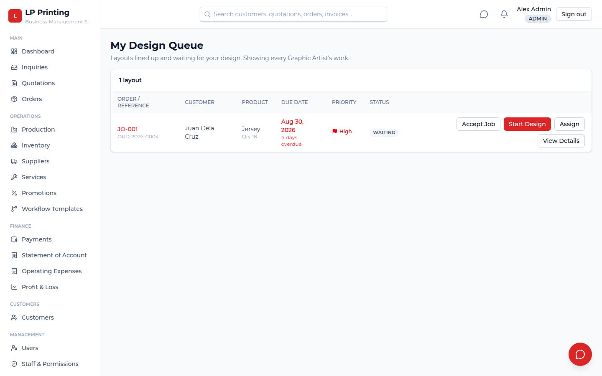

**Important Note:** The "Design Feedback" page is a read-only feed of messages tied to your design jobs — it's a way to see comments left about your work, not a structured rework form. Actual rework (from a failed QC check) is tracked separately as a Rework item, which routes the job back through QC once resolved.

## 9.4 What the Customer Sees

Both the logged-in Customer portal and the public tracking page (Chapter 18) show a plain-language progress timeline built from the job's real workflow stages — never a hardcoded list. It always looks like: *Order Received → Quotation/Approved → Job Order → (each real stage of that job's actual workflow, marked done/current/upcoming) → Completed.*

## 9.5 Quality Control (QC)

A job entering its QC stage can be checked two ways depending on where you access it: a simple Pass/Fail form (with quantity checked/failed and defect notes), or — if the order has a linked Customer Form — a detailed **QC Checklist** listing every individual item, letting you check them off one by one with running Total/Checked/Remaining counts.

**Important Note:** The item-by-item QC Checklist only has a **Complete QC** action (which always records a Pass based on whichever items are checked) — it does not have a Fail button of its own. To fail a batch and send it to rework, use the simpler Pass/Fail QC form instead.

A **Fail** result creates a Rework record (assigned stage, staff, and defect description); once the rework is resolved and completed, the job automatically re-enters QC rather than skipping ahead.

---

# 10. Inventory & Suppliers

## 10.1 Inventory Items

**Purpose:** Track raw materials and stock on hand.

**Who Can Use It:** Staff/Admin can create items; Staff/Admin/Production can record stock movements.

**Step-by-Step (creating an item)**

1. Open **Inventory → + New Item**.
2. Enter SKU, Name, Unit, and a Reorder Threshold.
3. Save — the item starts at zero quantity.

**Recording stock** happens three ways: **receiving a purchase** from a Supplier (10.2), a **manual movement** (Allocate/Consume/Reject/Waste/Adjust) from the item's own page, or **production consumption**, recorded directly from a Job Order against its expected material usage.

**Low Stock**
Any item at or below its reorder threshold is flagged with a "Low" badge and a yellow banner on the Inventory list. This is a visible indicator only — there is currently no email or system-wide alert generated for it.

*Figure 24 — Inventory list.*
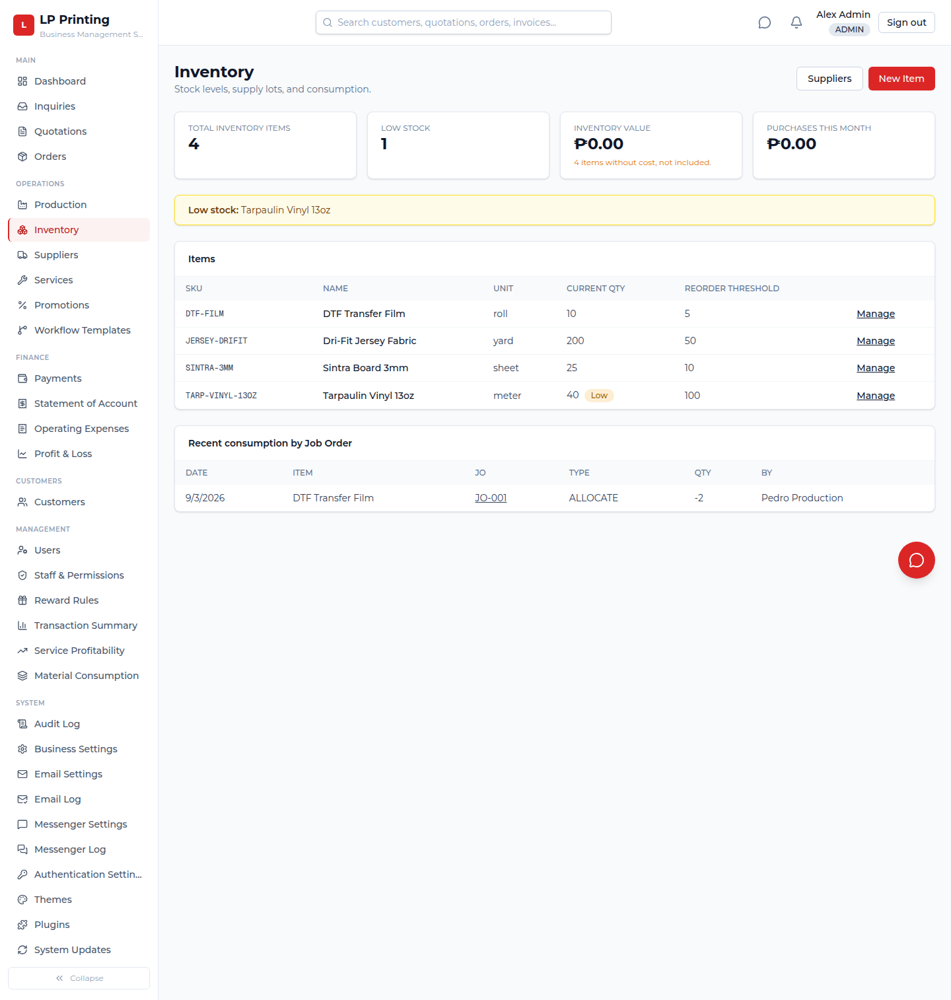

*Figure 25 — Inventory item detail, with movement history.*
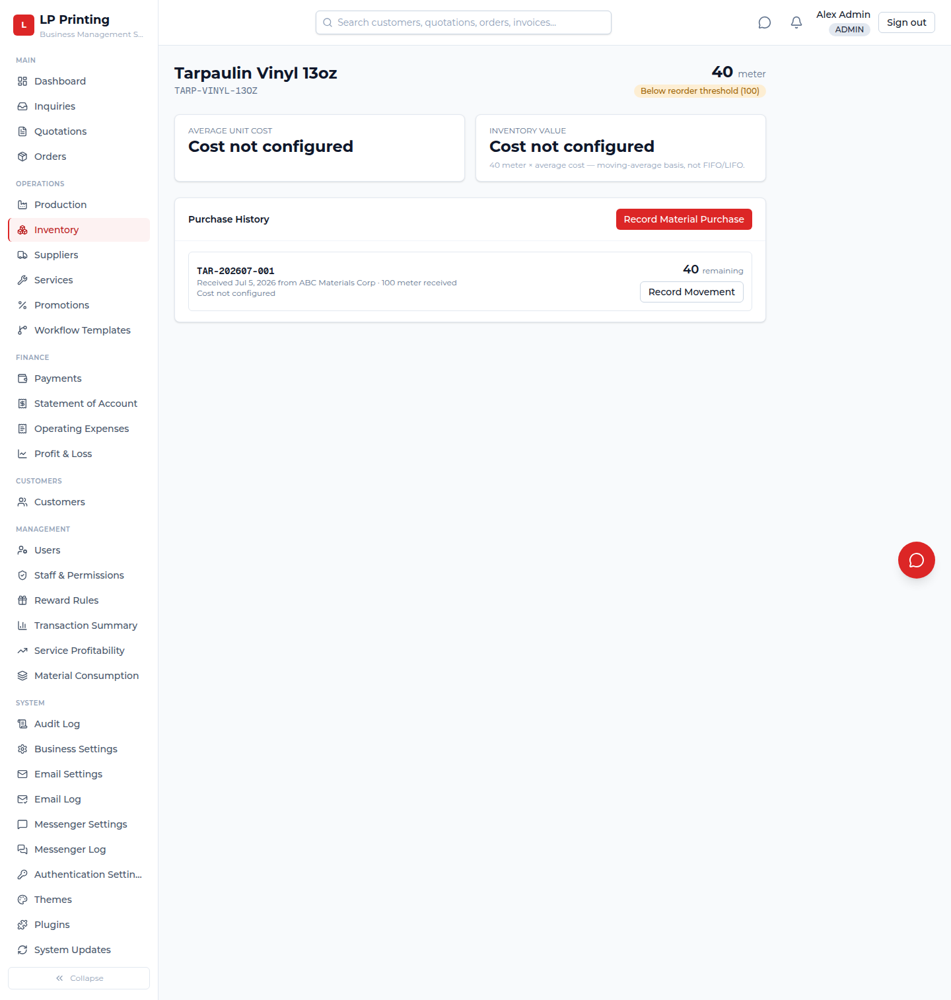

**Important Note:** Production does **not** automatically consume inventory just by moving a job through its stages — recording consumption against a Job Order (or a manual movement) is always a separate, deliberate action.

## 10.2 Suppliers & Purchasing

**Purpose:** Maintain a directory of material suppliers and record what you've bought from them.

**Who Can Use It:** Staff/Admin with `SUPPLIER_VIEW`/`SUPPLIER_MANAGE` (directory), `PURCHASE_MANAGE` (recording a purchase).

**Step-by-Step**

1. Open **Suppliers → + New Supplier**, enter contact/payment-terms details, save.
2. From an Inventory item's page, **Record Purchase**, choosing the Supplier, quantity, and cost — this both receives the stock and logs the purchase in one step.

**Important Note:** LP System does not have a formal purchase-order/approval workflow (no PO number, no "expected delivery" tracking) — recording a purchase and receiving the stock are the same single action. A purchase can be cancelled only if none of it has been consumed yet. Suppliers cannot be deleted, only deactivated.

*Figure 26 — Suppliers list.*
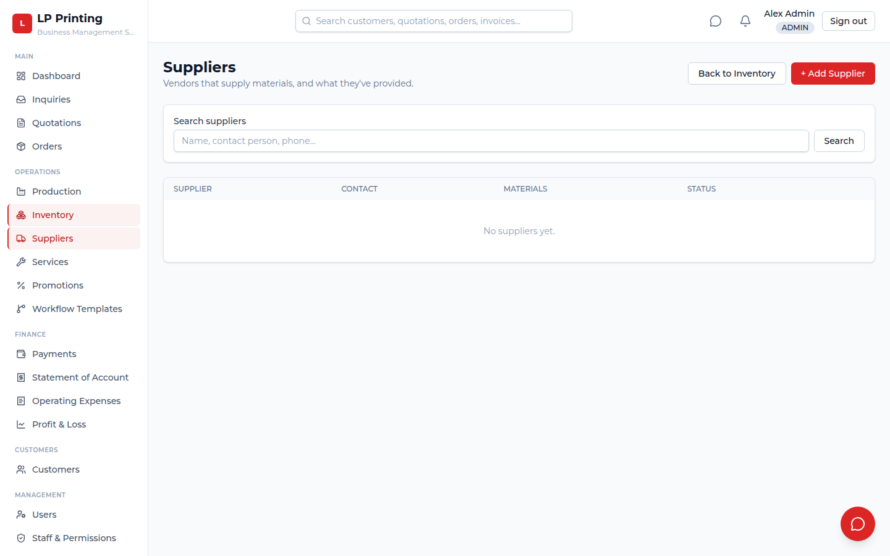

---

# 11. Services & Promotions

## 11.1 Services

**Purpose:** Define what you sell — each Service is a product/offering with its own pricing and production flow.

**Who Can Use It:** Staff/Admin with `SERVICE_MANAGE`.

**Step-by-Step**

1. Open **Services → + New Service**.
2. Enter the name, category, description, and choose its **Production Flow** (Workflow Template) — or create a new one on the spot.
3. List any spec fields customers/staff will need to fill in for this service (e.g. size, material).
4. Save.

Pricing (base price, quantity tiers) and, for services with a defined Bill of Materials, a full **Costing** page with a margin simulator are managed from the Service's own detail page.

*Figure 27 — Services list.*
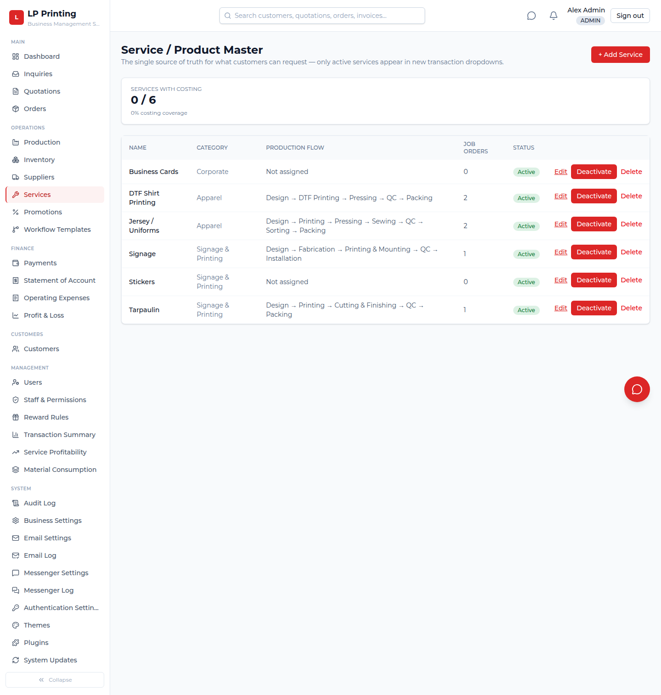

## 11.2 Promotions

**Purpose:** Apply automatic percentage or fixed discounts to eligible quotations.

**Who Can Use It:** Staff/Admin with `SERVICE_MANAGE`.

**Step-by-Step**

1. Open **Promotions → + New Promotion**.
2. Choose whether it applies to one Service or store-wide, a date range, a min/max quantity, and either a percent or fixed discount.
3. Save — new promotions can be toggled active/inactive afterward, but not edited once created.

**Important Note:** Promotions only apply automatically to Services that have live/instant pricing configured. For services that staff price manually, a promotion has no effect and must be reflected in the quotation's manual discount instead.

*Figure 28 — Promotions list.*
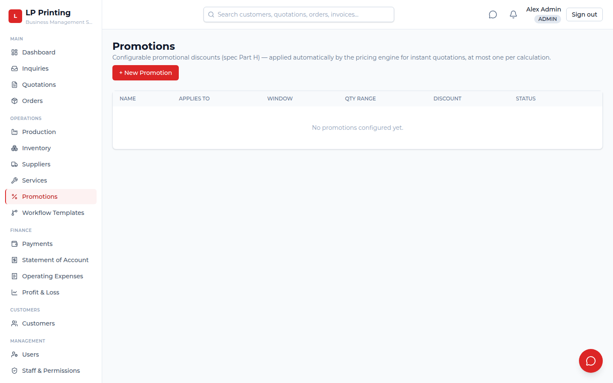

---

# 12. Payments

## 12.1 Recording a Payment

**Purpose:** Record money received against an order.

**Who Can Use It:** Staff/Admin with `PAYMENT_RECORD`.

**Step-by-Step**

1. Open the **Record Payment** form — reachable from the **Payments** page (Figure 29) *or* directly from the Dashboard's **Receivables** card (Chapter 14) *or* from an Order's detail page.
2. Select the **Order** the payment is for.
3. Enter the **Amount**, choose a **Payment method** (Cash, Bank Transfer, GCash, Maya, Cheque, Other), and optionally a Reference Number, Payment Date, a proof file, and Notes.
4. Click **Record Payment**.

**What Happens Next**
A staff-recorded payment is saved as **Confirmed** immediately — there is no separate verification step for payments Staff enter themselves. The order's paid/outstanding balance updates right away, and if this payment satisfies the order's payment-terms rule, its first Job Order may be created automatically (Chapter 8).

*Figure 29 — Payments list and Record Payment.*
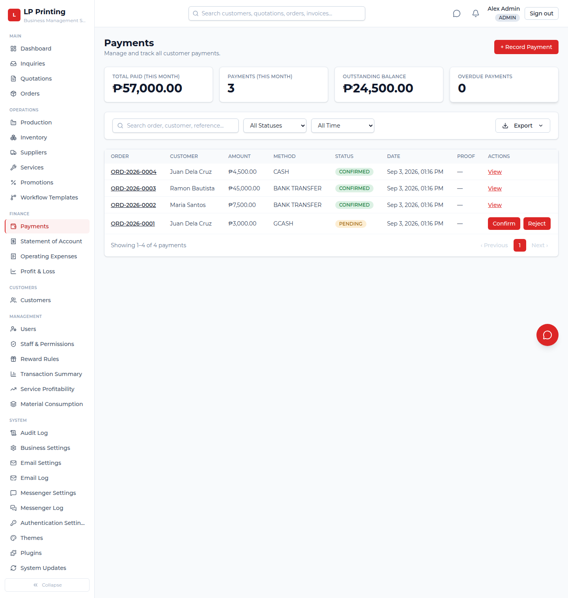

*Figure 30 — Record Payment form.*
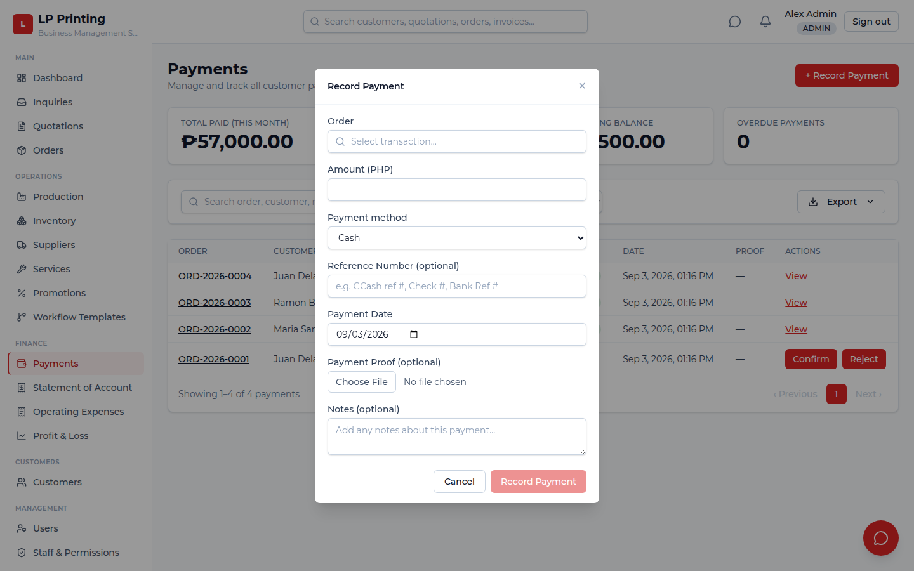

## 12.2 Customer-Submitted Payment Proof

A **Customer** can separately upload proof of a payment they made (GCash, Maya, Bank Transfer, or Other) themselves. Unlike a Staff-recorded payment, this one is saved as **Pending** until a Staff member with `PAYMENT_VERIFY` clicks **Confirm** (or `PAYMENT_REJECT` clicks **Reject**) from the Payments list.

## 12.3 Partial vs. Fully Paid

The system tracks a running total of Confirmed payments against each order's total and its required partial-payment percentage, giving three practical states: not enough paid yet, partially paid (enough to satisfy the terms), and fully paid. This same balance calculation is what gates whether production can start and whether an order can be released.

**Important Note:** A dedicated "edit a recorded payment" or "refund a payment" action does not currently exist in the interface, even though permission entries for them exist in the permission list — don't expect to find working Edit/Refund buttons on a payment.

---

# 13. Statement of Account (SOA)

**Purpose:** Produce a full account statement for a customer — every charge, payment, and running balance over a period.

**Who Can Use It:** Staff/Admin with `SOA_VIEW` (view) / `SOA_GENERATE` (create new statements).

**Step-by-Step**

1. Open **Statement of Account**, search for and select a customer.
2. Click **Generate Statement of Account**.
3. Choose **Monthly Statement** (pick month/year) or a **Custom Date Range**.
4. Add any manual Adjustments/Credits if needed.
5. Generate.

**What Happens Next**
The statement lists an Opening Balance, every Order charge and Payment/Credit within the period, a running balance, and the closing Outstanding Balance. It's saved with its own statement number and can be printed/saved as PDF from its own document view (Figure 32).

**Important Notes**

- You can also set up a **recurring monthly schedule** so a statement is generated automatically each month.
- A Customer can see their own past statements listed under their Payments page, each linking to the same printable document.

*Figure 31 — Customer SOA page (staff view).*
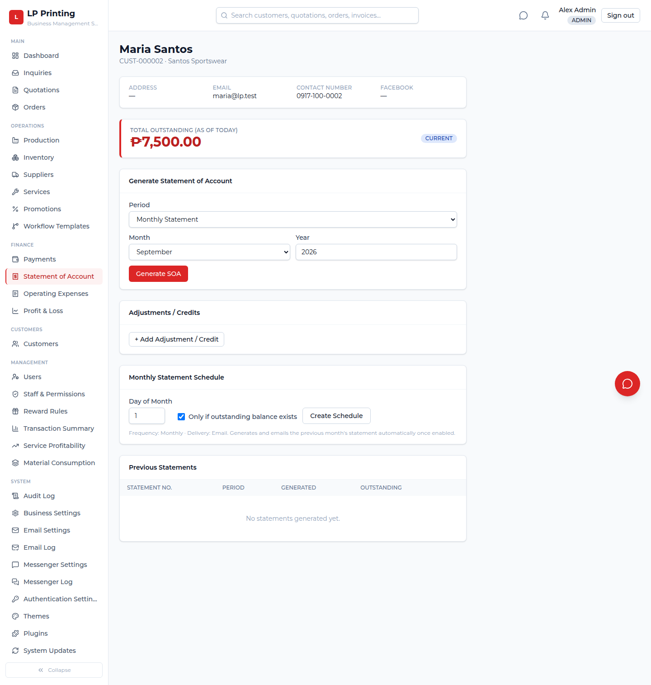

---

# 14. Receivables

**Purpose:** Give Staff/Admin a single place to see which customers currently owe money and act on it, without hunting through individual customer records.

**Who Can Use It:** Staff with financial visibility (`PAYMENT_VIEW`), or Admin. Shown as the **"Receivables Requiring Attention"** card on the Dashboard.

Each customer with an outstanding balance appears as a card showing their total owed and a status badge (**Current / Due / Overdue**), with three actions:

- **View** — opens a detail popup: Total Outstanding/Current/Due/Overdue tiles, a list of transactions needing attention, recent payments, and footer buttons **View SOA**, **Message**, and **Record Payment**.
- **SOA** — opens the same Generate Statement tools as Chapter 13, without leaving the Dashboard.
- **Message** — opens a chat with the customer inline (if you have messaging permission).

*Figure 32 — Receivables Requiring Attention on the Dashboard, and the Notifications bell.* (see Figure 2 above, which shows this same card)

---

# 15. Invoices

LP System does not keep a separate "Invoice" record — **the Order itself is the invoice.** Its printable Invoice document is generated on demand from the order, with the same reference number as the order (Chapter 16), so a customer never has to reconcile two different numbers for the same job.

**Purpose:** Give the customer a formal billing document.

**Step-by-Step**

1. From the Order detail page, open the invoice (or reach it via the printable **View Document** link, or the emailed/shared link).
2. Use your browser's **Print / Save as PDF** to save or print it.

The invoice shows the Invoice Number, Invoice Date, Payment Status (**Unpaid / Partially Paid / Paid**), the customer's details, every line item from the originating quotation, the subtotal, amount paid, outstanding balance, and total — plus a QR code linking back to the order.

**Important Note:** The invoice document has a "Due Date" field in its layout, but it is not currently populated from anywhere — it will always display as a dash. Rely on the order's own due date field (if set) or your organization's standard payment terms instead.

*Figure 33 — Printable Invoice.*
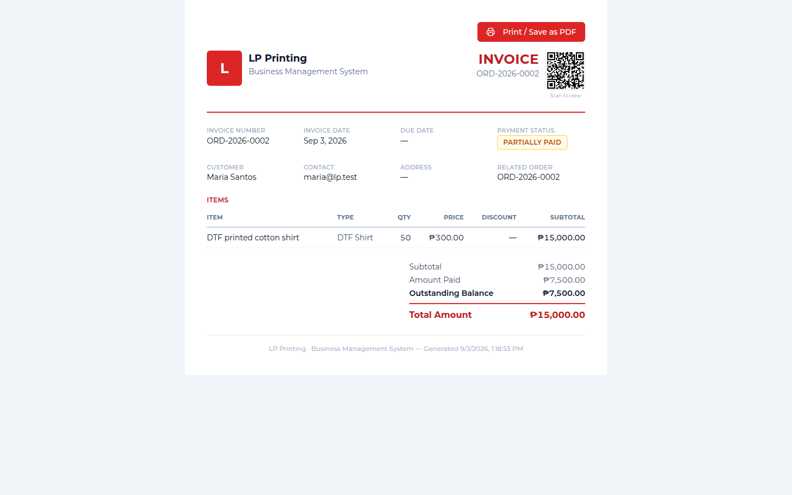

---

# 16. Document Numbering & QR Codes

## 16.1 Numbering

Every Quotation, Order, and Invoice shares a single, unified numbering system — there is no longer a "QUO-" or "ORD-" style prefix distinguishing them (older demo/seed records may still show an old-style prefix; new records will not). The format is:

```
YYYY-MMDD-NNNN
```
for example **`2026-0903-0007`** — the year, month and day the number was issued, and a sequential 4-digit counter, drawn from a single running counter so numbers never collide.

- When an Order is created from an approved Quotation, it **keeps the exact same number** — the Quotation and its resulting Order/Invoice all show the same reference. This is deliberate: a customer only ever has to remember one number for the whole job.
- A Job Order reuses its parent Order's number for the first job order under it; a second or third job order on the same order gets a `-2`, `-3` suffix.
- Statements of Account use their own separate format, `SOA-YYYY-MM-NNNN`.
- Customer records use `CUST-NNNNNN`.

**Important Note:** The public Track Order page's example placeholder text still shows the old prefixed style (e.g. "ORD-2026-0826-0007") — this is just stale example copy, not a sign that the numbering system changed back. Enter whatever reference number actually appears on your document.

## 16.2 QR Codes

A QR code appears on every printable Quotation, Invoice, and Job Order document, captioned "Scan to view." Scanning it opens that exact document's page inside the app — protected by the same login/ownership rules as if you'd navigated there normally. It is a convenience for someone already authorized to see the record (e.g. a driver or the customer themselves, if signed in on their phone) — it is **not** a link to the public tracking page, and does not bypass any access control.

---

# 17. Customer Portal

Customers use the same application as Staff, signed in with their own account, with everything scoped to their own data.

## 17.1 Customer Dashboard

Shows the customer's own recent quotations, orders, and any account notices.

*Figure 34 — Customer Dashboard.*
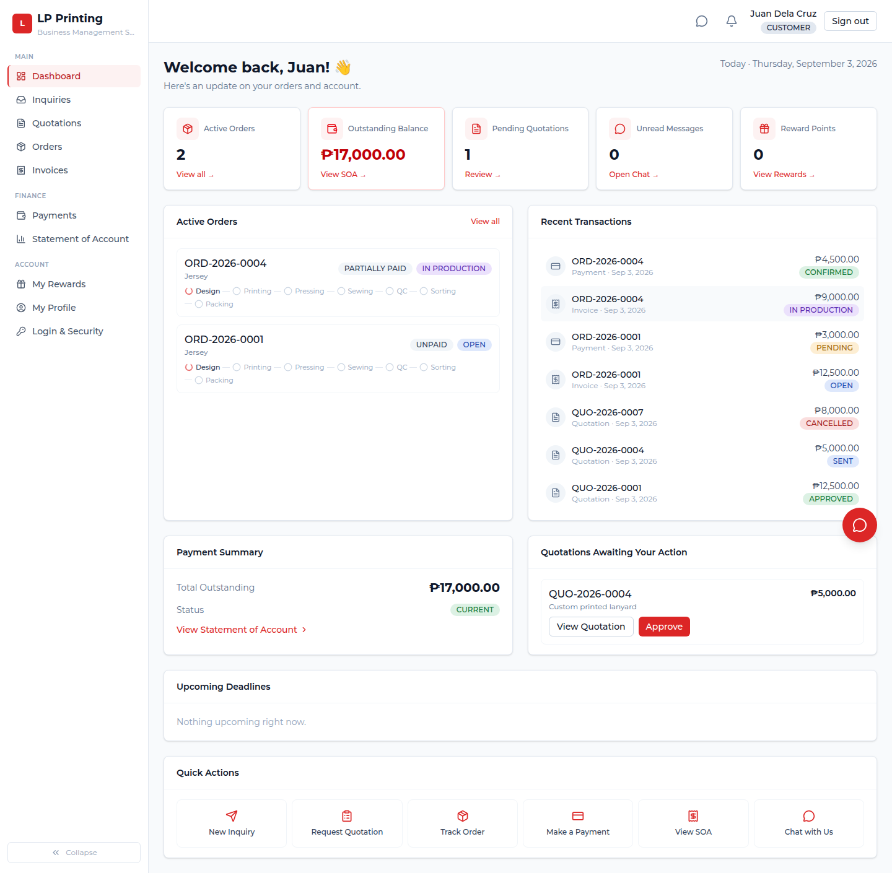

## 17.2 My Profile

**Purpose:** Let a customer manage their own contact details, login email, and password.

**Step-by-Step**

1. Open **My Profile** (under Account).
2. Edit Name, Company, Email, Contact Number, Address, or Facebook URL as needed, and Save.
3. Under **Login & Security**, change your password, or (if you signed up with Google/Facebook only) set a password for the first time.

*Figure 35 — My Profile.*
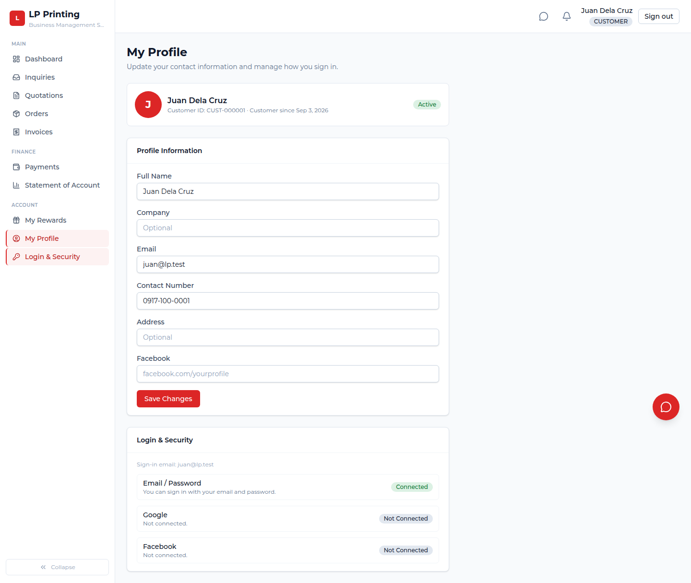

## 17.3 My Rewards

Shows the customer's points balance, a redeem-for-voucher form, their vouchers, and their full earn/redeem history (Chapter 5.5).

*Figure 36 — My Rewards.*
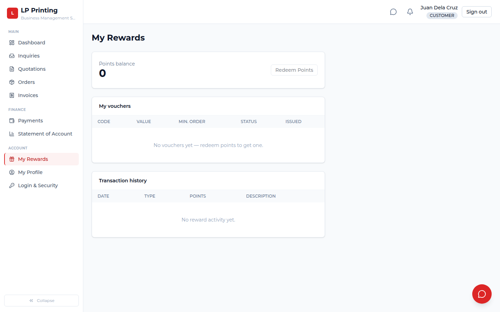

## 17.4 Quotations, Orders, Invoices, SOA

A Customer sees exactly the Quotations (17.5), Orders, Job Orders, and Invoice pages described in Chapters 6–8 and 15, scoped to their own records only, plus their own Statement of Account (Chapter 13). They can approve or reject a **Sent** quotation, make limited edits while it's still open, upload payment proof, and message Staff about a specific order.

*Figure 37 — Customer's own Orders list.*
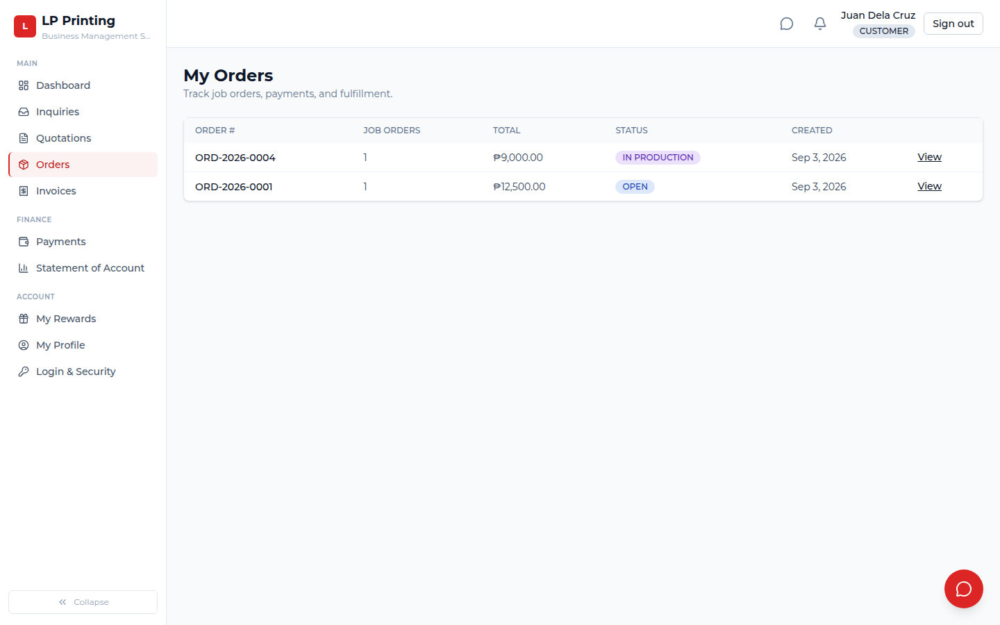

## 17.5 Messages

The **Messages** page is an internal chat with your assigned Staff contact for inquiries, quotations, and orders — separate from any Facebook Messenger notifications the business may send (Chapter 19.3). Use the floating Chatbox icon from anywhere in the app to start or continue a conversation.

---

# 18. Public Order Tracking

**Purpose:** Let anyone with a reference number check an order's status — no account required.

**Who Can Use It:** Anyone (Guest).

**Step-by-Step**

1. Go to **`/track`** (linked from the Login page as "Track Your Order," or shared directly).
2. Enter the **Reference Number** exactly as it appears on your document.
3. Enter the **Email or Phone Number on file** for that order — despite being labeled "(optional)," the system requires it as a second factor before showing anything.
4. Click **Track Order**.

**What Happens Next**
If both match, you'll see: the order number, item, customer name, order date, payment status, job order number, a **Current Stage** highlight, outstanding balance (only shown if greater than zero, with a note to sign in or contact the business to pay), and a full step-by-step **Order Progress** timeline — each real production stage marked Done, Current, or upcoming, with dates and total elapsed time.

**Important Notes**

- If the reference and contact don't match anything, you'll see: *"We couldn't find a matching transaction with that reference and contact info. Please double-check both and try again, or contact us for assistance."*
- If the reference matches a Quotation that hasn't become an Order yet, you'll see a message explaining that full tracking will be available once it's approved.
- Lookups are rate-limited to prevent abuse (a small number of attempts per reference and per visitor within a short window) — if you see a "too many attempts" message, wait a few minutes.
- Only safe, customer-facing information is ever shown here — no internal notes, costs, or other customers' data.
- Staff can also generate a direct **tracking link** for a specific order from its detail page — opening that link works without typing a reference/contact at all, since the link itself is the authorization.

*Figure 38 — Public Track Order page.*
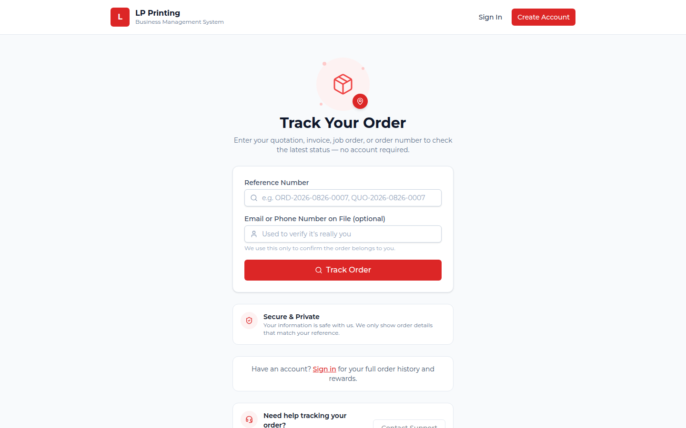

*Figure 39 — A successful tracking result, with the full progress timeline.*
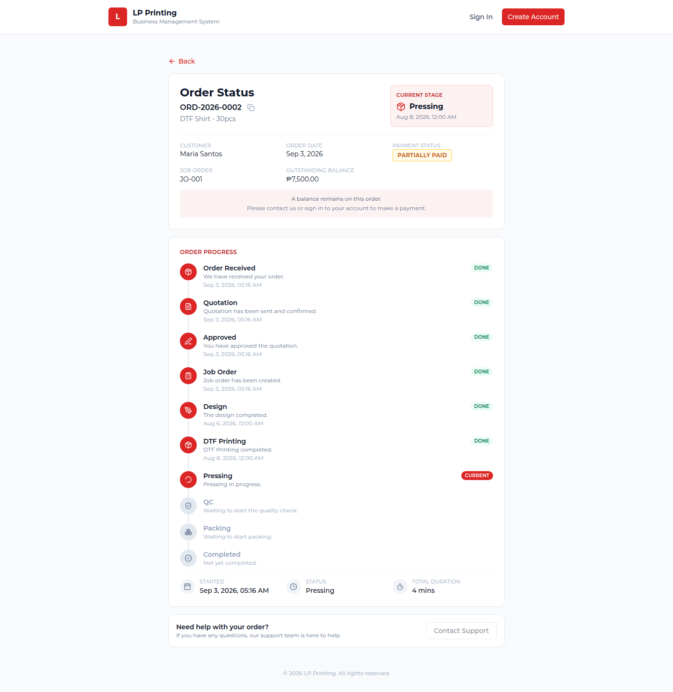

---

# 19. Notifications & Email

## 19.1 In-App Notifications

See Chapter 3.4 for the bell/notification center used by every signed-in role.

## 19.2 Email

**Purpose:** Automatically email customers and/or staff for business events (quotation sent, order confirmed, payment recorded, etc.).

**Who Can Use It:** Admin, under **Email Settings**.

**Setup**

1. Choose a provider: **Gmail, Yahoo, Outlook,** or **Custom SMTP**. Gmail/Yahoo/Outlook each need an app-specific password from that provider (not your regular account password) — Custom SMTP lets you enter host/port/security settings directly.
2. Under **Email Events**, toggle individual events on/off, grouped by area (Inquiry, Quotation, Orders, Payments, Job Order, Production, Fulfillment, Rewards, Documents, Statement of Account, Account, Customer Form).
3. Optionally edit the wording of each **Email Template**, using `{{placeholders}}` like customer name, amount, balance, and tracking link.
4. Use **Send Test Email** to confirm your settings work before relying on them.

**Email Log**
Every attempted email — sent, failed, sending, or queued — is listed in **Email Log**, with recipient, subject, related record, and a **Retry** option for failed ones.

*Figure 40 — Business Email Settings.*
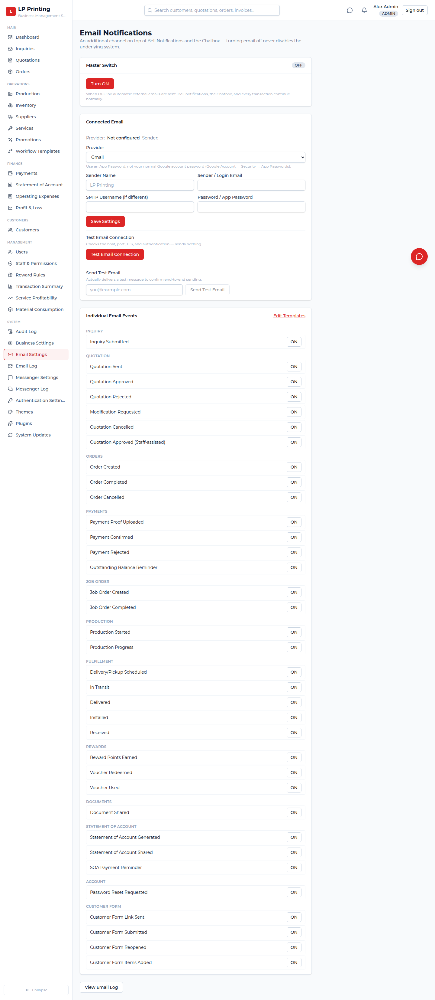

*Figure 41 — Email Log.*
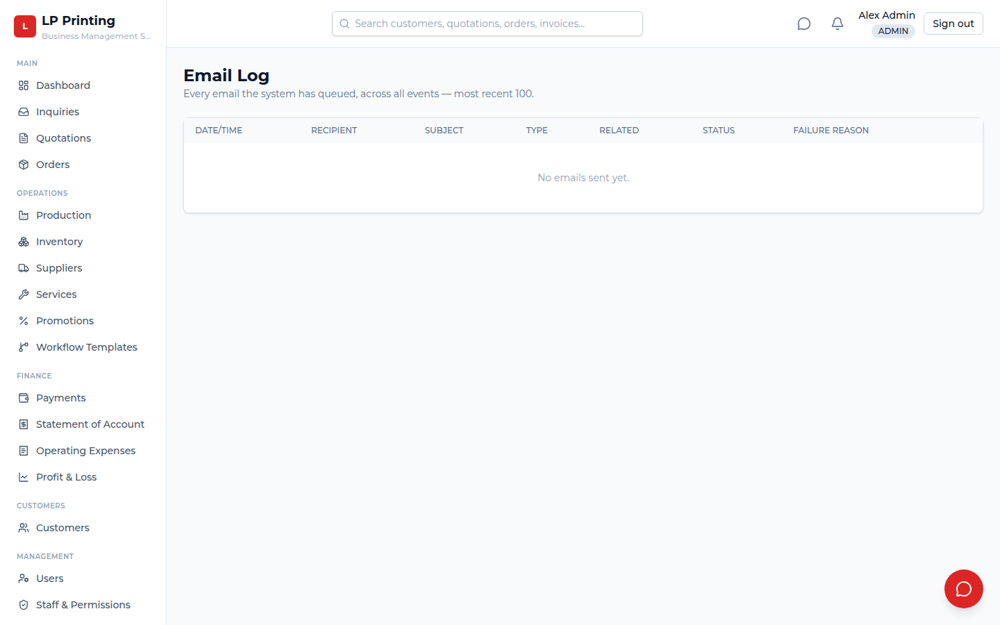

**Important Note:** Only whatever provider is actually configured with real credentials will work. Never store or share an email/SMTP password outside this settings page — it is encrypted at rest and never shown back to you once saved.

## 19.3 Facebook Messenger Notifications

This is a genuinely working feature, not a placeholder — but it depends entirely on the business having its own Meta (Facebook) App and Page connected under **Messenger Settings**, with the given webhook URL pasted into that Meta App's configuration. Once connected, customers can opt in via a Messenger link and receive order-update notifications there, tracked in the **Messenger Log** the same way as Email Log (including a "Skipped" status for a customer who hasn't opted in, or if the Page isn't configured). This is separate from the in-app **Messages** feature (17.5).

---

# 20. Reports & Financial Management

## 20.1 Dashboard

The Dashboard (Admin's is at `/admin/dashboard`; Staff see a permission-scoped version at `/dashboard`) is the daily home screen, with:

- KPI tiles: **Today's Sales, Outstanding Balance, Open Orders, Pending Payments, New Inquiries.**
- **Needs Attention** — a live list of things waiting on you (quotations awaiting approval, orders awaiting payment, delayed production, low stock).
- **Financial Overview** — a period switcher (Today/Week/Month/Quarter/Semi-Annual/Year) with revenue and order-count trend.
- **Receivables Requiring Attention** (Chapter 14).
- **This Month's Financials** — Sales → Production Cost → Gross Profit → Operating Expenses → Net Profit, linking to the full P&L.
- **Production Today**, **Orders by Status**, **Today's Activity**, and **Business Insights** (QC pass rate, low-stock count, new/returning customers, points issued/redeemed this month).

*Figure 42 — Admin Dashboard.*
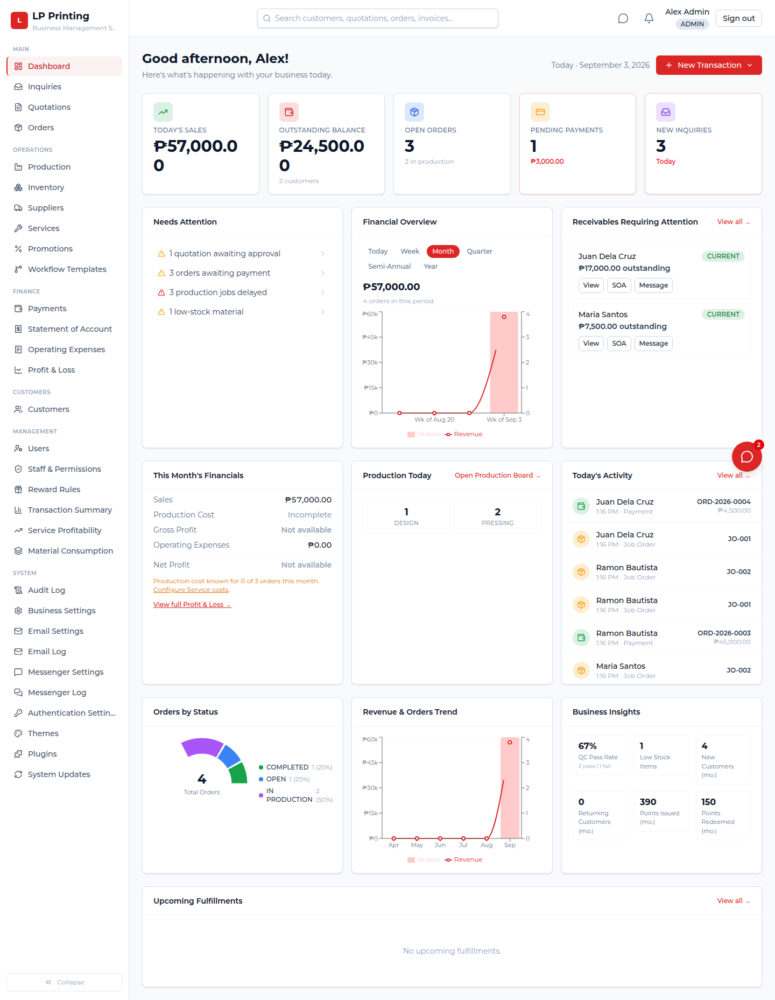

**Important Note:** Financial cards (Outstanding Balance, Pending Payments, Financial Overview, Receivables, This Month's Financials) are only shown to Staff who hold payment-viewing permission — a Staff member without it sees a dashboard scoped to just their own areas.

## 20.2 Transaction Summary

A period-based activity report: total Inquiries, Quotations, Orders, Invoices, and Payments; Sales/Revenue; Outstanding Balance; Cancelled and Completed counts; plus Orders-by-Status and Payments-by-Method charts. This is the only one of the four reports below with its own **Generate PDF** button.

*Figure 43 — Transaction Summary.*
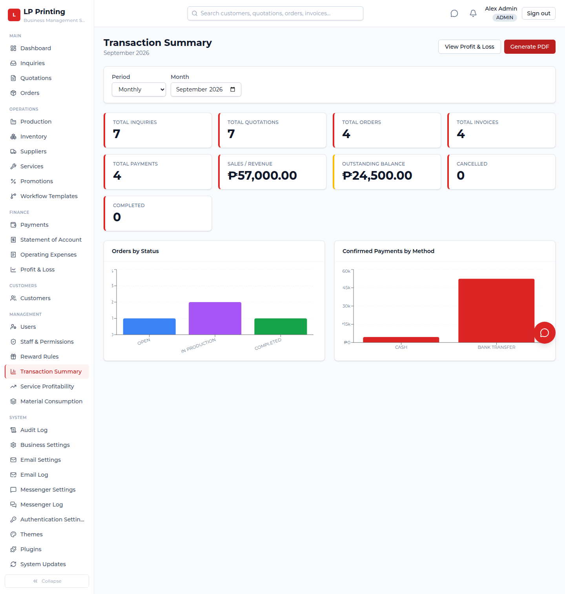

## 20.3 Profit & Loss

Revenue (confirmed payments in the period) minus estimated production cost, giving Gross Profit; minus Operating Expenses, giving Net Profit — plus margin percentages, for the same period selector used everywhere else.

**Important Note:** If any order contributing to the period doesn't have its production cost configured, the report will show **"Not available"** for Gross/Net Profit rather than a silently-understated number, along with a note on exactly how many of the contributing orders are missing cost data.

*Figure 44 — Profit & Loss report.*
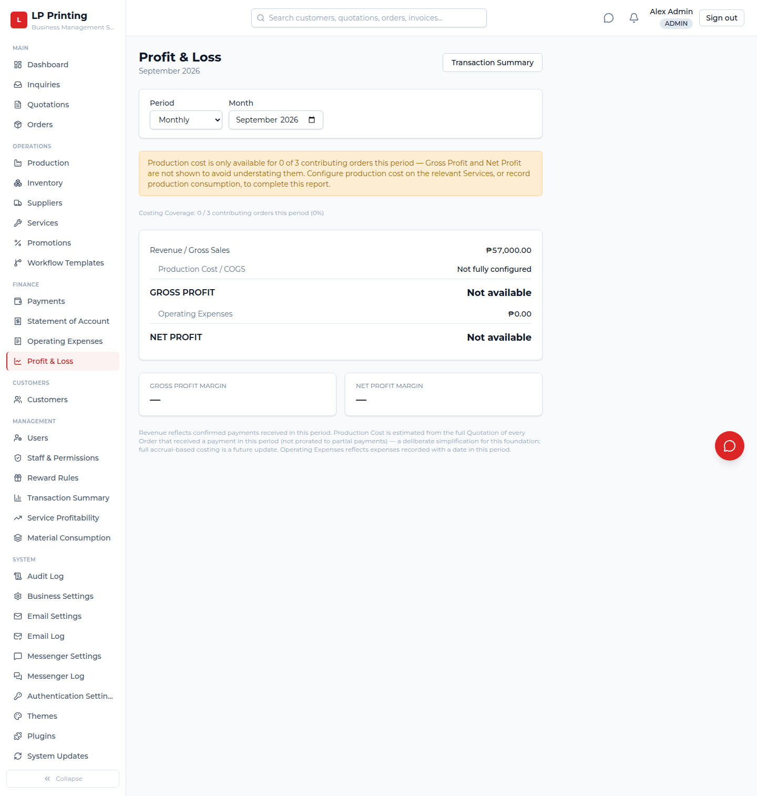

## 20.4 Service Profitability & Material Consumption

**Service Profitability** breaks sales/cost/profit/margin down per Service for the period. **Material Consumption & Variance** compares actual material usage against expected usage per job — a variance shown here isn't automatically waste; check the reason recorded on the job order.

*Figure 45 — Service Profitability report.*
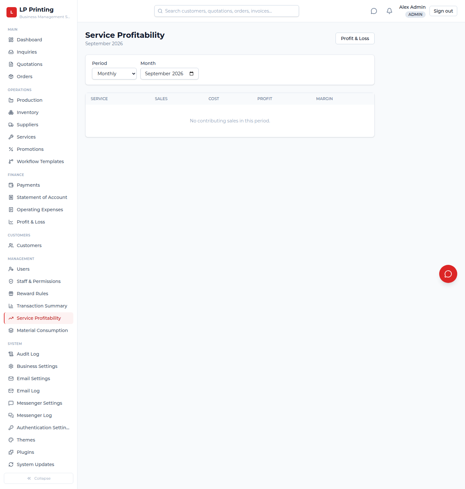

## 20.5 Operating Expenses

Staff/Admin with `EXPENSE_MANAGE` record and categorize operating expenses here; they feed directly into the Profit & Loss report for the matching period.

*Figure 46 — Operating Expenses.*
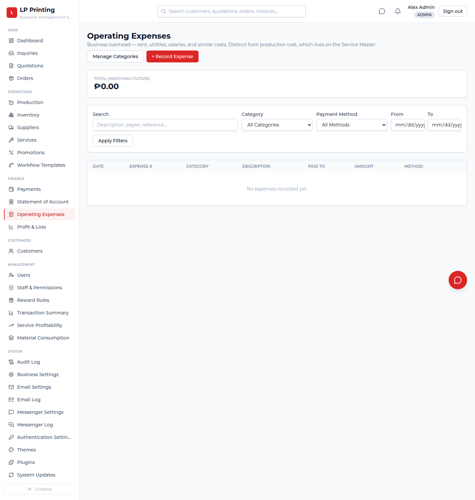

**Important Note:** Only **Orders** and **Payments** lists currently have a real CSV/Excel export. The Profit & Loss, Service Profitability, and Material Consumption reports have no export at all beyond your browser's own Print function; only Transaction Summary has a working "Generate PDF."

---

# 21. Business Settings

**Purpose:** Configure the business identity and behavior used throughout the app, its documents, and its emails.

**Who Can Use It:** Admin only, under **Business Settings**.

The form is organized into these sections:

- **Business Identity** — Business name, Tagline, Description, **Business logo** and **Favicon** (each independently set by Upload / Image URL / "Use Default").
- **Contact Information** — Contact number, Email address, Facebook/social media, Website.
- **Business Address** — Complete address, City/Municipality, Province, Postal/ZIP code.
- **Payment Instructions** — free text shown on Invoice and Statement of Account documents (e.g. bank/GCash details).
- **Regional** — Business Time Zone, used for every timestamp across the app. Takes effect on the next server restart, not instantly.
- **Communication** — how new Chatbox conversations get assigned to Staff (Manual / Automatic / Manual with automatic fallback after 15 minutes).
- **Production** — the Auto-select Graphic Artist toggle described in Chapter 9.3.

Email, Messenger, and sign-in provider settings are configured on their own dedicated pages, not this form (Chapter 19).

*Figure 47 — Business Settings.*
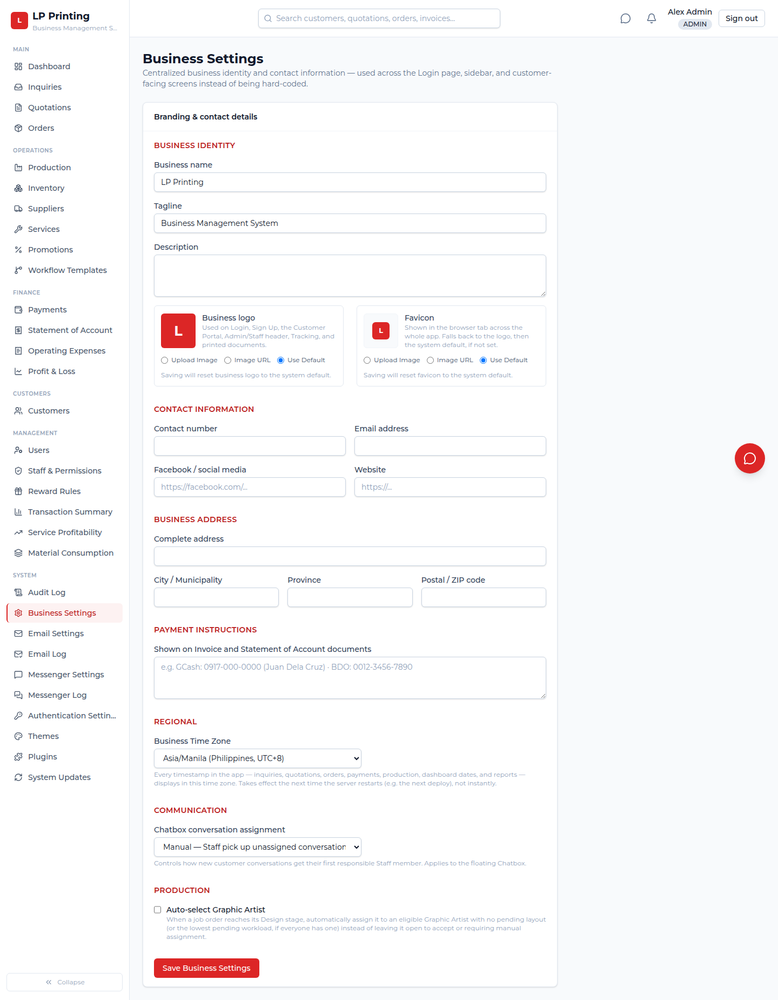

**Important Note:** Whatever logo/favicon is set here is what actually appears across the whole app, on documents, and in the browser tab — if neither is set, a plain branded default is used automatically. Changes here take effect immediately for everyone, without a redeploy.

---

# 22. Mobile & Tablet Usage

LP System is fully usable on a phone or tablet, with layouts that adapt rather than simply shrinking the desktop view.

- **Phone** — the sidebar collapses into a menu button; a bottom/condensed navigation and dashboard cards stack vertically; the Production board shows one stage at a time instead of a full Kanban row.
- **Tablet** — similar single-stage Production view; most list/detail pages otherwise behave like desktop with adjusted spacing.
- **Desktop** — the full experience, including the drag-and-drop Kanban board (roughly 1024px width and up).

*Figure 48 — Login page on mobile.*
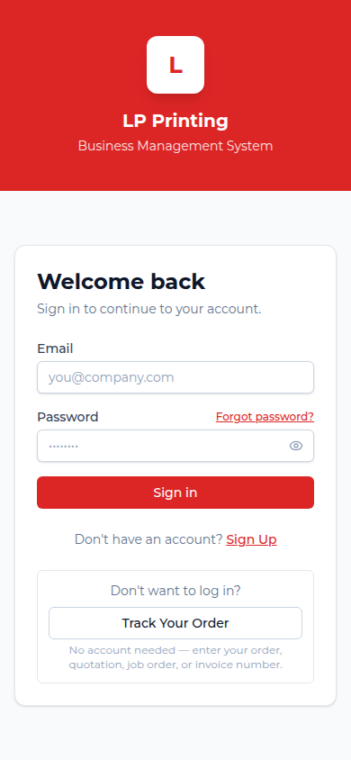

*Figure 49 — Admin Dashboard on mobile.*
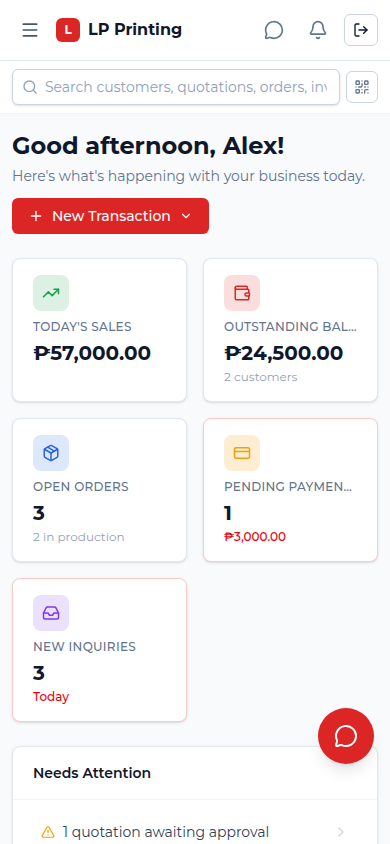

*Figure 50 — Production board on mobile (single-stage view).*
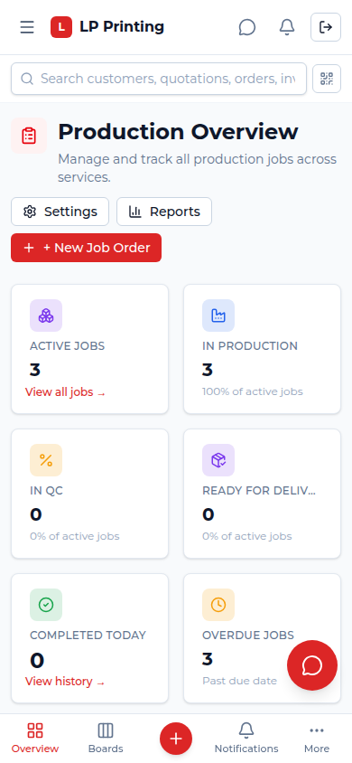

*Figure 51 — Production board on tablet.*
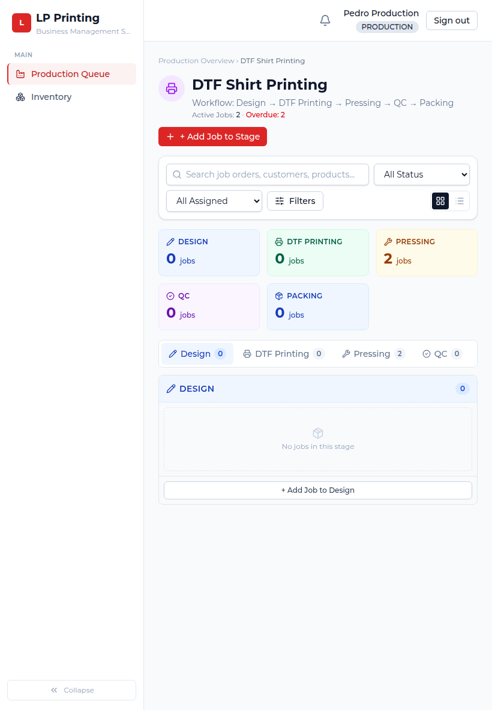

*Figure 52 — Customer Dashboard on mobile.*
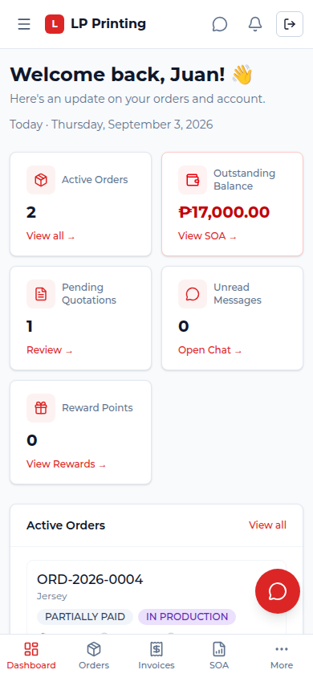

*Figure 53 — Public Track Order on mobile.*
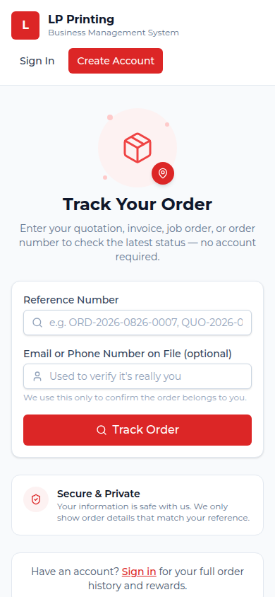

---

# 23. Troubleshooting

| Problem | Possible Cause | Solution |
|---|---|---|
| **Cannot log in** | Wrong email/password, or the account has been deactivated. | Double-check your credentials. If you believe your account should work, ask an Admin to confirm it's still Active under Users/Staff & Permissions — a deactivated account shows the same generic "Invalid email or password" message. |
| **Page appears stale / changes aren't showing** | Most pages update immediately on save with no refresh needed — if something looks out of date, it's most likely a browser cache issue rather than the system not saving. | Refresh the page. If it still looks wrong, sign out and back in. |
| **A staff member can't access a module they should be able to** | Their Staff & Permissions record doesn't currently grant that permission. | An Admin should open their Staff & Permissions page and grant the specific permission or an appropriate preset. |
| **A staff member can't perform an action they used to be able to** | A permission may have been changed or removed. | Check their current permissions; re-grant if needed. |
| **A quotation can't be approved** | It isn't in **Sent** status (Draft/Revision Requested/Approved/etc. can't be approved directly), or the acting Staff account lacks `QUOTATION_APPROVE_REJECT`. | Send the quotation first if it's still a Draft; confirm the approver's permissions. |
| **An order won't proceed / a job order won't start** | Payment terms may not be satisfied yet (partial-payment percentage not met, and no Approved Terms exception recorded). | Record the required payment, or have an Admin/authorized Staff document an Approved Terms exception on the order. |
| **A production stage can't be completed / "not the next step" error** | The system rejects moving a job to a non-adjacent stage — the board itself may be showing stale state. | Refresh the board and try again from the actual current stage; use Reassign or Return to Previous Stage if the job is genuinely stuck. |
| **A payment can't be recorded** | The acting account lacks `PAYMENT_RECORD`. | Ask an Admin to grant it, or have an authorized Staff member record it. |
| **A customer can't see a document** | The document/share link may have been generated for a different record, or the customer isn't signed in to the account that owns it. | Re-generate the share link from the record's own page, or confirm the customer's login is linked to the correct customer record. |
| **Track Order says it can't find a match** | Reference number or the associated email/phone doesn't match exactly, or the reference is for a Quotation that hasn't become an Order yet. | Double-check both fields for typos; if it's still a quotation, tracking becomes available once it's approved. |
| **Too many tracking attempts** | The public Track Order page rate-limits repeated lookups. | Wait a few minutes and try again with the correct details. |
| **Email notification not received** | The relevant event toggle may be off, the provider credentials may be wrong, or the message failed to send. | Check **Email Log** for that recipient/event — a Failed entry shows the reason and can be retried; confirm the event's toggle is on in Email Settings. |
| **Messenger notification not received** | The customer hasn't opted in via the Messenger link, or the Page/App isn't fully configured. | Check **Messenger Log** — a Skipped entry explains exactly why. |
| **Document doesn't display correctly when printed** | Browser print settings (margins/scale) can distort the layout. | Use "Print / Save as PDF" from the document's own Print button, and check your browser's print preview before printing. |
| **Mobile layout looks cramped or a table is hard to read** | Some data-dense pages (large tables, the full Kanban board) are genuinely desktop-oriented. | Use a tablet/desktop for those specific screens where possible, or rotate your device to landscape. |

---

# 24. FAQ

**How do I create a customer?**
Go to Customers → **+ New Customer**, fill in their details, and Save. See Chapter 5.2.

**How do I create a quotation?**
Go to Quotations → **+ New Quotation**, pick a customer, add line items, and Save. See Chapter 6.1.

**How do I approve a quotation on behalf of a customer?**
Open the quotation and use the staff approval action — you'll be required to type a reason, which is recorded for audit purposes. See Chapter 6.4.

**How do I create an order?**
In the normal flow, you don't — approving a quotation creates its order automatically. You can also create one directly from Orders → **+ New Order** if there's no quotation. See Chapter 7.1.

**How do I assign a production job to someone?**
Design jobs are claimed from the Design Queue, or reassigned by Staff with Design-management permission. Other production jobs are worked from the Production board and can be reassigned from a job's detail panel. See Chapter 9.

**How do I record a payment?**
From the Payments page, an Order's detail page, or the Dashboard's Receivables card — all open the same Record Payment form. See Chapter 12.1.

**How do I check outstanding balances?**
The Dashboard's Receivables card, the Statement of Account for a specific customer, or the Outstanding Balance shown on any Order/Invoice. See Chapters 13–15.

**How does a customer track an order without logging in?**
They go to `/track`, enter their reference number and the email/phone on file. See Chapter 18.

**How do I send a quotation to a customer?**
Click Send to Customer on the quotation, then share its link (or, if they have a login, they'll see it in-app). See Chapter 6.5.

**How do I print an invoice?**
Open the order's invoice document and use Print / Save as PDF. See Chapter 15.

**How do I change business information (name, logo, address, etc.)?**
Business Settings, Admin only. See Chapter 21.

**How do permissions work?**
Every Staff account's access is controlled individually, permission by permission (or via a preset bundle) — two Staff accounts can have completely different access. Role alone (Staff vs. Admin) doesn't determine what you can do; the specific permissions granted to that account do. See Chapter 4.3.

---

# 25. Glossary

**Admin (Administrator)** — the account role with full, unrestricted access to every part of the system.

**Customer** — an account role scoped to only that person/company's own quotations, orders, invoices, and statements.

**Staff** — an account role whose access is determined entirely by individually granted permissions, not by the role itself.

**Production** — an account role for shop-floor staff working the production boards.

**Graphic Artist** — not a separate account role — a Staff account (usually with that job title) holding the `DESIGN_VIEW` permission, giving it access to the Design Queue.

**Inquiry** — an initial customer request, before pricing exists as a formal Quotation.

**Quotation** — a formal, priced proposal for a job, which becomes an Order once approved.

**Order** — a confirmed job to be produced and delivered; also functions as the Invoice.

**Job Order** — the actual unit of production work under an Order, which moves through a Workflow Template's stages.

**Invoice** — the printable billing document for an Order; there is no separate Invoice record, it's generated from the Order itself.

**Statement of Account (SOA)** — a full account statement for a customer over a period: opening balance, charges, payments, running balance, and closing balance.

**Receivable** — an outstanding (unpaid) balance owed by a customer.

**Workflow Template** — the ordered list of production stages a type of job follows (e.g. Design → Printing → QC → Packing).

**Production Stage** — one step within a Workflow Template (e.g. "Pressing" or "QC").

**QC (Quality Control)** — the mandatory checkpoint stage every workflow has exactly one of; a job cannot skip it.

**Rework** — production work sent back for correction after failing QC, which re-enters QC once resolved.

**Payment Terms** — the rule governing how much must be paid before production can start on an order (a required partial percentage, or a documented Approved Terms exception).

**Reference Number / Document Number** — the single unified number (format `YYYY-MMDD-NNNN`) shared across a Quotation and the Order/Invoice it becomes.

**QR Code** — printed on documents, linking directly (and securely) to that document's page inside the app.

**Tracking Link** — a staff-generated, token-based public URL that opens an order's tracking view without a reference/contact lookup.

**Permission** — one specific granted capability (e.g. `PAYMENT_RECORD`) that determines whether a Staff account can perform a particular action, independent of its role.

**Permission Preset** — a ready-made bundle of permissions (e.g. Manager, Sales Staff, Cashier) that can be applied to a Staff account in one step.

---

*End of LP System User Manual & System Documentation.*
